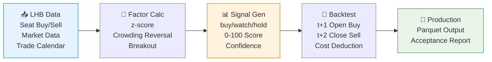

# 🎯 skill-alpha-hotmoney-reversal

[简体中文](README.md) | **English**

> A06 Hot Money Seat Cooling Reversal & Collaborative Breakout Factor: Capturing reversal signals after crowded coordination and high-intensity breakout continuation based on Dragon-Tiger List data.

<p align="center">
  
  
  
  
  
</p>

`skill-alpha-hotmoney-reversal` is an A06 Alpha factor Skill provided by the QuantSkills organization. It calculates cooling reversal and collaborative breakout factors based on Dragon-Tiger List hot money seat data, supporting executable backtesting and production release.

QuantSkills GitHub Organization: https://github.com/quantskills

## 🎯 Factor Logic

**Core Hypothesis**: Short-term crowding after hot money coordination on the Dragon-Tiger List will reverse; few non-overheated, repeated seat coordinated high-intensity net buys have breakout continuation.

**Formula**:
```
factor_value = (-z(net_buy_to_amount) - z(ret_5d) - z(ret_10d)) / 3 + 0.25 * watch + 3.0 * buy
```

- Sort direction: Higher `factor_value` = stronger signal
- Market: A-share Dragon-Tiger List stocks
- Mode: `hotmoney_executable_open`

## ⚡ Factor Flow



## 📦 Input Data Requirements

Official calculation uses PandaData data library:

| Field | Description | Source |
|---|---|---|
| `date` / `trade_date` | Trade date | `get_lhb_detail` / `get_trade_cal` |
| `symbol` / `ts_code` | Stock code | PandaData |
| `agency` / `rank` / `b_value` / `s_value` | LHB seat and buy/sell amount | `get_lhb_detail` |
| `open` / `close` / `limit_up` / `trade_status` | Executable backtest and halt/limit handling | `get_market_data` |
| `amount` / `volume` / `high` / `low` | Crowding and position diagnostics | `get_market_data` |

**Dependencies**: Python, pandas, pyarrow, PandaData

Environment setup:
```bash
export PANDA_DATA_USERNAME=your_username
export PANDA_DATA_PASSWORD=your_password
```

## 🚀 Quick Start

### Install Dependencies

```bash
pip install pandas pyarrow
```

### Demo Mode (Offline)

```bash
python scripts/factor.py --demo
```

### Full Pipeline

```bash
# 1. Calculate factor
python scripts/factor.py

# 2. Validate factor
python scripts/validate.py

# 3. Executable backtest
python scripts/backtest.py

# 4. Production release
python scripts/update_production.py --full-refresh --bootstrap-start-date 20230601
```

## 📊 Output

| Field | Description |
|---|---|
| `factor_value` | Raw factor value |
| `score` | Daily cross-sectional 0-100 score |
| `signal` | `buy` / `watch` / `hold` |
| `confidence` | 0-1 confidence |
| `data_version` | `pandadata-lhb-hotmoney-executable-open-a06-v1` |

## 📈 Executable Criteria

- Signal formed after `t` day close
- Buy at `t+1` open, skip if halted or limit-up at open
- Sell at `t+2` close
- Standard bilateral cost `0.30%`, stress cost `0.50%`

## ✅ Acceptance Requirements

- No future functions allowed
- Must pass train/test, cross-year out-of-sample, and overfitting checks
- Must output IC, Rank IC, ICIR, quintile returns, top/bottom long-short, max drawdown, turnover, and signal samples
- Standard cost and `0.50%` stress cost must both pass release thresholds
- Cannot enter production without passing validation

## 📁 Project Structure

```
├── 开发产物/
│   ├── SKILL.md              # Factor documentation
│   ├── skill.json            # Metadata
│   ├── references/
│   │   └── data_guide.md     # Data guide
│   └── scripts/
│       ├── factor.py         # Factor calculation entry
│       ├── validate.py       # Factor validation
│       ├── backtest.py       # Executable backtest
│       ├── build_release.py  # Release builder
│       ├── dev_scheduler.py  # Dev scheduler
│       └── update_production.py  # Production update
└── 生产产物/
    ├── SKILL.md              # Production docs
    ├── 数据库.parquet         # Production data
    ├── 发布验收报告.json       # Acceptance report
    └── 发布验收报告.md         # Acceptance report (readable)
```

## 🔗 Related Skills

- [`skill-quant-factor-skill-factory`](https://github.com/quantskills/skill-quant-factor-skill-factory) - Factor production tool
- [`skill-factor-evaluation`](https://github.com/quantskills/skill-factor-evaluation) - IC test & factor evaluation
- [`skill-quant-factor-directional-alpha`](https://github.com/quantskills/skill-quant-factor-directional-alpha) - Directional Alpha factor library

## 📄 License

This project is licensed under the GPLv3 License - see the [LICENSE](LICENSE) file for details.
