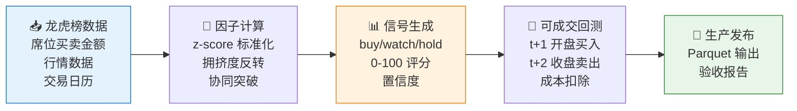

# 🎯 skill-alpha-hotmoney-reversal

**简体中文** | [English](README.en.md)

> A06 游资席位冷却反转与协同突破因子：基于龙虎榜游资数据，捕捉协同拥挤后的反转信号与高强度突破延续性。

<p align="center">
  
  
  
  
  
</p>

`skill-alpha-hotmoney-reversal` 是 QuantSkills 组织提供的 A06 Alpha 因子 Skill。它基于龙虎榜游资席位数据，计算冷却反转与协同突破因子，支持可成交回测和生产发布。

QuantSkills GitHub 组织：https://github.com/quantskills

## 🎯 因子逻辑

**核心假设**：龙虎榜游资协同后的短期拥挤会反转；少数不过热、重复席位协同的高强度净买入具有突破延续性。

**计算公式**：
```
factor_value = (-z(net_buy_to_amount) - z(ret_5d) - z(ret_10d)) / 3 + 0.25 * watch + 3.0 * buy
```

- 排序方向：`factor_value` 越大越强
- 适用市场：A 股龙虎榜股票
- 唯一模式：`hotmoney_executable_open`

## ⚡ 因子流程



## 📦 输入数据要求

正式计算使用 PandaData 数据拉取库：

| 字段 | 说明 | 来源 |
|---|---|---|
| `date` / `trade_date` | 交易日期 | `get_lhb_detail` / `get_trade_cal` |
| `symbol` / `ts_code` | 股票代码 | PandaData |
| `agency` / `rank` / `b_value` / `s_value` | 龙虎榜席位与买卖金额 | `get_lhb_detail` |
| `open` / `close` / `limit_up` / `trade_status` | 可成交回测与停牌涨停处理 | `get_market_data` |
| `amount` / `volume` / `high` / `low` | 拥挤度与位置诊断 | `get_market_data` |

**依赖**：Python、pandas、pyarrow、PandaData

环境变量配置：
```bash
export PANDA_DATA_USERNAME=your_username
export PANDA_DATA_PASSWORD=your_password
```

## 🚀 快速开始

### 安装依赖

```bash
pip install pandas pyarrow
```

### Demo 模式（不联网）

```bash
python scripts/factor.py --demo
```

### 完整流程

```bash
# 1. 计算因子
python scripts/factor.py

# 2. 验证因子
python scripts/validate.py

# 3. 可成交回测
python scripts/backtest.py

# 4. 生产发布
python scripts/update_production.py --full-refresh --bootstrap-start-date 20230601
```

### 使用 PandaData 固定快照构建发布版

```bash
python scripts/build_release.py \
  --details <panda_lhb_detail.parquet> \
  --calendar <panda_trade_calendar.parquet> \
  --quotes <panda_market_data.parquet> \
  --start-date 20230601 \
  --end-date 20260605 \
  --output <数据库.parquet> \
  --report <发布验收报告.json>
```

## 📊 输出结果

| 字段 | 说明 |
|---|---|
| `factor_value` | 因子原始值 |
| `score` | 每日横截面 0-100 评分 |
| `signal` | `buy` / `watch` / `hold` |
| `confidence` | 0-1 置信度 |
| `data_version` | `pandadata-lhb-hotmoney-executable-open-a06-v1` |

## 📈 可成交口径

- 信号在 `t` 日收盘后形成
- `t+1` 开盘买入，停牌或开盘涨停跳过
- `t+2` 收盘卖出
- 标准双边成本 `0.30%`，压力成本 `0.50%`

## ✅ 验收要求

- 不允许未来函数
- 必须通过训练/测试、跨年度样本外和过拟合检查
- 必须输出 IC、Rank IC、ICIR、五层收益、顶底层多空、最大回撤、换手率和信号样例
- 标准成本与 `0.50%` 压力成本必须同时通过发布门槛
- 不通过验证不得进入生产

## 📁 项目结构

```
├── 开发产物/
│   ├── SKILL.md              # 因子说明书
│   ├── skill.json            # 元数据
│   ├── references/
│   │   └── data_guide.md     # 数据指南
│   └── scripts/
│       ├── factor.py         # 因子计算主入口
│       ├── validate.py       # 因子验证
│       ├── backtest.py       # 可成交回测
│       ├── build_release.py  # 发布版构建
│       ├── dev_scheduler.py  # 开发调度
│       └── update_production.py  # 生产更新
└── 生产产物/
    ├── SKILL.md              # 生产产物说明
    ├── 数据库.parquet         # 生产数据
    ├── 发布验收报告.json       # 验收报告
    └── 发布验收报告.md         # 验收报告(可读)
```

## 🔗 相关 Skill

- [`skill-quant-factor-skill-factory`](https://github.com/quantskills/skill-quant-factor-skill-factory) - 因子生产工具
- [`skill-factor-evaluation`](https://github.com/quantskills/skill-factor-evaluation) - IC 测试与因子评估体系
- [`skill-quant-factor-directional-alpha`](https://github.com/quantskills/skill-quant-factor-directional-alpha) - 方向性 Alpha 因子库

## 📄 许可证

本项目基于 GPLv3 许可证开源 - 详见 [LICENSE](LICENSE) 文件。
