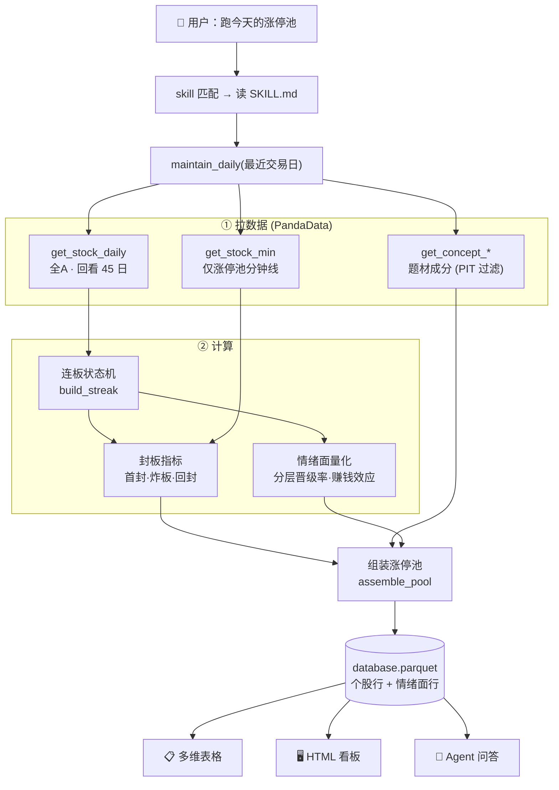
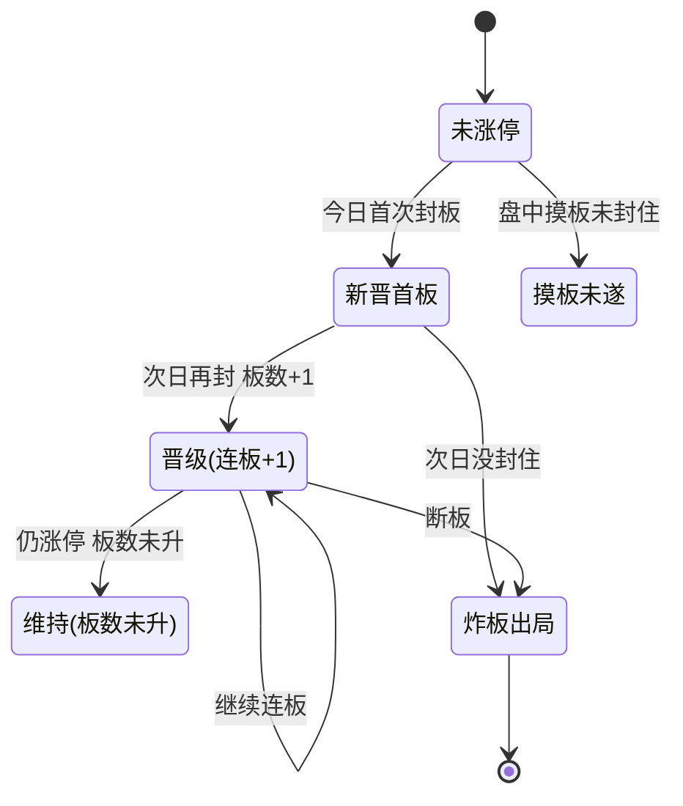

# skill-b6-limitup-pool · 涨停池动态管理

[](https://github.com/quantskills/join/blob/main/COMMUNITY_RULES.md) [](LICENSE)

> ⚠️ **Community Project（社区项目）**：本项目由社区成员创建，**未经 QuantSkills 官方审核 / 认证 / 背书**。
> **仅供量化研究与教育示例，不构成投资建议，不承诺任何收益。** 边界声明见文末。
> 声明文件 [SKILL.md](SKILL.md) ｜ English [README.en.md](README.en.md) ｜ 许可 [LICENSE](LICENSE)（GPL-3.0-only）

> 每日维护 A 股涨停池，标记**首板 / 连板数 / 炸板次数 / 回封时间**，并做**题材分组**、
> **特殊形态**（天地板·地天板·一字·秒板·烂板）、**情绪面量化**（分层晋级率·炸板率·赚钱效应）。
> 输出动态多维表格 / 暗色 HTML 看板，支持 Agent 问答。
>
> **类型**：监控预警 + 数据处理型 Skill ｜ **数据源**：PandaData ｜ **服务对象**：盘后复盘 agent · 连板情绪研究因子 · 人工复盘

---

## 一句话定位
**今天哪些票涨停、几板、炸没炸、什么题材、市场情绪冰点还是高潮。**

把全市场日线（+涨停股分钟线）压成一张「涨停池盘面视图」，而不是一份个股清单。

---

## 🔄 运行流程（一句话 → 落地结果）



> 分钟线拉不到（流量超限/服务异常）会**自动降级**到日线代理（炸板次数用日内回撤估、回封时间留空），主流程不中断。

---

## 🧬 动态状态机（每只票 vs 昨日涨停池）



每只票每天还会打一个**特殊形态**标签（优先级从高到低）：
`地天板 > 天地板 > 一字板 > 秒板 > 炸板未封 > 烂板(炸≥3或尾盘回封) > 反复板 > 实封`

---

## 💬 怎么说（自然语言触发，agent 自动调脚本/读 parquet）

| 你说 | 它做什么 |
|---|---|
| "跑一下今天的涨停池" / "维护涨停池" | 拉最新交易日，出连板梯队 + 炸板 + 题材 + 情绪面 |
| "今天最高几板？""炸板率多少？""赚钱效应？" | 读情绪面 summary 直接答 |
| "今天哪个题材最强 / 题材龙头是谁" | 按题材梯队厚度分组，标龙头 |
| "哪些票炸板了 / 谁尾盘回封的" | 列炸板次数、首封 → 回封时间 |
| "有没有天地板 / 地天板 / 烂板 / 一字板" | 按特殊形态筛 |
| "首板→2板晋级率多少" | 分层晋级率 |
| "出个涨停池 HTML 看板" | 生成暗色可视化看板 |
| "复盘 6月18号的涨停池" | 指定历史某天 |
| "回填 6 月这一个月" | 区间回填历史 |

## ⚙️ 可选参数（不说走默认）

| 参数 | 默认 | 怎么说 |
|---|---|---|
| 日期 | 最近交易日 | "复盘 6/18" |
| 股票池 | 全 A | "只看沪深300 / 中证1000 / 国证2000" |
| 精度 | 分钟精确 | "快一点别拉分钟" → 日线代理（炸板/回封精度降低） |
| 输出 | 看问法 | "口头答 / 给多维表格 / 出 HTML 看板" |

---

## 📦 输出结构（落地 parquet）

主键 `(trade_date, build_id, target_id, result_type)`，两类行：

| result_type | 一行代表 | 关键字段 |
|---|---|---|
| `limitup_pool` | 一只涨停/炸板个股 | `board_label`(首板/N连板) · `limit_up_streak` · `blow_up_count` · `first_seal_time`/`final_seal_time` · `special_pattern` · `lead_concept`(题材) · `pool_status` · `seal_metric_source`(minute/daily_proxy) |
| `limitup_sentiment` | 当日 1 行市场情绪面 | `n_limit_up` · `market_blow_rate` · `max_height` · `promote_rate_by_tier`(分层晋级率) · `prev_limitup_premium`(赚钱效应) |

- 结果落地：`生产产物/database.parquet`（**追加合并**，不覆盖历史）
- 看板样例：`生产产物/sample_pool.html`、当日复盘 `生产产物/涨停复盘_*.html`

---

## ⌨️ 命令行（手动跑）

```bash
export PANDA_USERNAME=<86手机号>; export PANDA_PASSWORD=<密码>
python 开发产物/scripts/build.py --mode daily                 # 当日维护（含分钟，盘后 ~16:00）
python 开发产物/scripts/build.py --mode daily --no-minute     # 仅日线代理（省流量）
python 开发产物/scripts/build.py --mode backfill --start 20260601 --end 20260619
python 开发产物/scripts/render.py                             # 打印多维表格
python 开发产物/scripts/render_html.py --out pool.html        # HTML 看板
```

> ⏰ 盘后 ~16:00 跑（日线 + 分钟线收盘后就绪）。无参数 `--mode daily` 自动定位最近交易日。

---

## 🗂️ 目录

```text
build-b6-limitup-pool/
├── README.md                 ← 你在这里
├── 开发产物/
│   ├── SKILL.md              · agent 调用规则 + 字段表
│   ├── skill.json            · 入口清单
│   ├── references/api_guide.md · 接口口径 / 计算公式 / 错误码
│   └── scripts/
│       ├── build.py          · 引擎：连板状态机/封板指标/题材/情绪面 + run/maintain_daily/backfill
│       ├── render.py         · 多维表格(markdown)
│       ├── render_html.py    · 暗色 HTML 看板
│       └── test.py           · 单测（含真实数据冒烟）
└── 生产产物/
    ├── SKILL.md              · 生产读取规则
    └── database.parquet      · 结果（每日追加）
```

详细字段口径见 [开发产物/SKILL.md](开发产物/SKILL.md) 与 [开发产物/references/api_guide.md](开发产物/references/api_guide.md)。

---

## ⚠️ 边界与免责声明（社区规则 §4 / §8）

- **项目状态**：Community Project，未经 QuantSkills 官方审核 / 认证 / 验证 / 背书，非生产可用认证项目。
- **数据来源**：PandaData（`panda_data` ≥ 0.0.9）。
- **假设条件**：涨停以接口 `limit_up` 为准（缺失按板块 10/20/30% 兜底）；连板在交易日序列累加（停牌不算断板）。
- **参数**：回看窗口 / 股票池 / 分钟精度可配置（见 api_guide）。
- **已知限制**：分钟缺失降级日线代理（精度下降）；题材为接口粗口径；特殊形态为规则判定。
- **风险边界**：输出为研究/复盘用的**客观统计，不含买卖建议**。
- **项目性质**：**仅供量化研究与教育示例，不构成投资建议，不承诺收益，不暗示策略安全或保证盈利。**
- **署名/许可**：口径借鉴同作者 alpha-A3 连板因子（同源避免漂移）；许可证 **GPL-3.0-only**（[LICENSE](LICENSE)）。
- **维护者**：[@ZLHad](https://github.com/ZLHad)。
