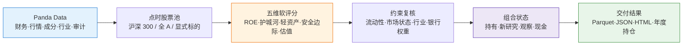

# 🏰 巴菲特护城河研究 Skill

**简体中文** | [English](README.en.md)

> 一个面向 A 股与美股研究的巴菲特式投资分析 Skill：用点时数据识别高质量公司，给出可复核的研究建议、持仓复核、年度持仓记录与历史诊断。Q44 BUILD 只是其中负责计算与产出的执行组件，不是 Skill 的全部。

**项目状态**：QuantSkills Community Project（社区项目，未经审核不代表官方、认证、验证或背书）

**创建者 / 维护者**：[`dijia702`](https://github.com/dijia702)

<p align="center">
  
  
  
  
  
  
</p>

---

## 📖 这是什么

`skill-buffett-moat-screener` 是一个混合型研究 Skill。它把巴菲特式长期投资原则转化为可执行、可解释、可复核的研究流程；其中 Q44 BUILD 负责数据计算与生产化结果，Skill 同时定义研究口径、复核方式、年度记录和交付边界：

1. **研究队列**：从点时股票池与财务数据中计算五维连续软评分，输出优先研究、观察名单、暂缓研究等立场；
2. **组合复核**：维护持仓状态、现金权重与换仓理由。健康既有持仓不会仅因年度排名回落或估值上涨自动退出；
3. **历史诊断**：交付严格点时沪深 300、2010 起固定 A 股经典名单和美股固定研究池三条彼此区分的回测证据；
4. **可视化演示**：离线读取生产快照，生成 JSON 与独立 HTML，展示当前候选、持仓/换仓复核及年度持仓标的。

每一份结果都保留信号日期、数据日期、覆盖状态和版本信息。**事实与研究解读分开**：评分、持仓状态与回测记录是规则化输出；“优先研究”等只表示研究顺序，不是交易指令。

---

## ⚡ 研究流水线



---

## 🧮 五维软评分

各维度是连续评分锚点，而不是单一股票的刚性淘汰线。缺失指标不会自动填入中性分，而会影响有效权重与覆盖率。

| 维度 | 权重 | 研究含义 | 评分锚点 |
|---|---:|---|---|
| 资本回报 | 30% | 长期资本使用效率 | 10 年 ROE 均值，5%=0，18%=100 |
| 护城河 | 25% | 毛利率与稳定性 | 5 年毛利率，波动越大惩罚越高 |
| 轻资产 | 15% | 再投资压力 | 5 年 CapEx/净利润，低者得分更高 |
| 安全边际 | 15% | 经营盈利能力 | 5 年营业利润率，2%=0，25%=100 |
| 合理估值 | 15% | 新资金的价格纪律 | 当前 PE，10 倍=100，40 倍=0 |

### 银行与金融业

银行毛利率一律输出 `N/A`，不填充中性分；有效权重改由 ROE、ROA、ROA 下限、PB 与 PE 等可观测指标重分配。该规则避免把不适用的工业企业指标伪装成中性证据。

---

## 📅 年度持仓记录与证据范围

离线演示会列出每年的信号日、年度建议、持仓代码/名称/行业/入选理由、新入/保留/剔除和换手率。必须按以下口径理解：

| 时间段 | 年度持仓来源 | 可作出的结论 |
|---|---|---|
| 2010-2016 | 固定 18 只 A 股经典名单诊断 | 仅用于固定样本诊断；存在幸存者偏差，不能称为历史点时沪深 300 选股 |
| 2017-2026 | 严格点时沪深 300，软锚点评分 | 使用信号日可见成分，属于可验证的年度持仓研究记录 |
| 2015-2026 | 美股固定研究池 | 不是历史标普 500 或伯克希尔持仓复原；收益为价格收益，不含现金分红 |

回测是历史量化诊断，不代表未来表现。Panda 无可用 ETF 基准数据时，不虚构基准比较。

---

## 🚀 快速开始

### 1. 安装依赖

```powershell
pip install -r requirements.txt
```

### 2. 一键运行离线演示

```powershell
python scripts/demo.py --open
```

默认模式不访问网络、不读取凭证、不创建订单，生成：

```text
output/
├── demo_result.json    # 可供 agent 或程序复用的结构化结果
└── demo_report.html    # 当前候选、换仓复核与年度持仓可视化
```

### 3. 调用正式入口

```python
from scripts.build import run

result = run(
    {"as_of_date": "20260724", "index_symbol": "000300.SH"},
    config={"selection_mode": "soft", "soft_review_top": 50},
)

guidance = result["buffett_guidance"]
```

`buffett_guidance` 直接提供长期投资原则、研究立场、现金建议与研究边界，适合后续 agent 或人工复盘复用。

---

## 🗂️ 核心接口与交付物

| 需求 | 入口或产物 |
|---|---|
| A 股正式研究队列 | `scripts.build.run(input_data, config=None)` |
| 年度 A 股回测 | `scripts/backtest_runner.py` |
| 美股固定研究池回测 | `scripts/us_strategy.py` |
| 离线 JSON / HTML 演示 | `scripts/demo.py` |
| 版本化生产结果 | `生产产物/数据库.parquet` |
| 回测报告 | `生产产物/backtest_report.html` |
| 调用契约与方法边界 | `SKILL.md` |

运行严格点时沪深 300 回测：

```powershell
python scripts/backtest_runner.py --start 20170103 --end 20260724 `
  --markets a_share --a-mode strict --top-symbols 300 `
  --output "生产产物/backtest_a_share_strict.json"
```

---

## 📦 目录结构

```text
skill-buffett-moat-screener/
├── SKILL.md                 # BUILD 调用契约、方法与边界
├── README.md                # 中文项目说明
├── README.en.md             # English project documentation
├── CONTRIBUTING.md          # 中文贡献规范
├── agents/                  # Codex、Cursor、Hermes、OpenClaw 运行时适配器
├── scripts/                 # 数据、评分、组合、回测、报告与演示
├── references/              # Panda 接口映射与巴菲特方法说明
├── tests/                   # 合约、点时性、组合与演示测试
├── 生产产物/                # 版本化数据库、回测 JSON/HTML/图片
├── 开发产物/                # 可交付的开发镜像
└── secure_panda_worker.py   # 将环境凭证限制在子进程内的运行器
```

---

## 📐 核心约束

| 约束 | 说明 |
|---|---|
| 🧾 数据可追溯 | 记录信号日、实际数据日、覆盖状态、版本与结果类型 |
| 📅 点时一致 | 不用当前成分股倒推历史指数池；2017 前不声称完整点时沪深 300 历史 |
| 🏦 指标适用性 | 银行毛利率为 `N/A`，缺失指标不填中性分 |
| ⚖️ 质量优先 | 健康既有持仓不因短期排名或估值变化自动退出 |
| 💰 现金有效 | 机会不足或约束不满足时允许保留现金，不为满仓降低标准 |
| 🗣️ 研究非指令 | 不生成订单，不承诺收益，不提供个性化投资建议 |

---

## 🔐 数据凭证与安全

实时模式只从环境变量读取 Panda Data 凭证：`PANDA_DATA_USERNAME`、`PANDA_DATA_PASSWORD`，可选 `PANDA_DATA_BASE_URL`。不得将账号、密码、令牌、Cookie 或密钥写入源代码、JSON、Parquet、日志、截图或 Git 提交。

```powershell
$env:PANDA_DATA_USERNAME = "你的账号"
$env:PANDA_DATA_PASSWORD = "你的密码"
python scripts/demo.py --live --as-of-date 20260724
```

`--live` 只刷新研究结果，仍不创建订单。

---

## ✅ 验证与贡献

```powershell
python scripts/test.py
```

提交前请运行测试，并阅读 [CONTRIBUTING.md](CONTRIBUTING.md)。不得提交 `output/`、缓存、浏览器状态或任何敏感凭证。

## 🔌 跨运行时入口

| 运行时 | 入口 |
|---|---|
| Claude Code | 直接加载根目录 `SKILL.md` |
| Codex / OpenAI 兼容运行时 | `agents/openai.yaml` |
| Cursor | `agents/cursor-rule.mdc` |
| Hermes | `agents/portable-loader.md` |
| OpenClaw | `agents/portable-loader.md` |

所有适配器都以根目录 `SKILL.md` 为唯一方法契约，不复制评分或交易逻辑。

## ⚠️ 免责声明

本项目根据 Panda Data 与规则化方法生成历史量化研究结果，仅供研究与复盘参考，不构成任何投资建议。

## 📄 许可证

本项目以 [GPL-3.0-only](LICENSE) 发布。
