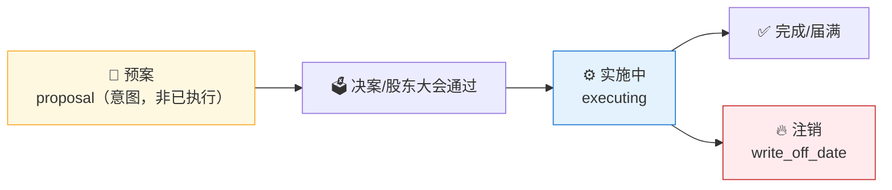

# 🔁 Buyback Monitor Skill

**简体中文** | [English](README.en.md)

> 社区状态：Draft（社区草案） · 创建者/维护者：[`abgyjaguo`](https://github.com/abgyjaguo)

> A股**股票回购监控**：按事件进程（预案→决案→实施→完成/注销）追踪回购、区分回购目的（注销式/激励/市值管理）、以**占总股本比例**衡量回购强度、回购价格区间对比现价 —— 全市场扫描或单票时间线，每个数据点标注来源接口与公告/进程日期。

<p align="center">
  
  
  
  
  
  
</p>

---

## 📖 这是什么

`buyback-monitor` 是一个 **Agent Skill**：以**回购事件**为中心扫描 A 股 `get_repurchase`，回答"**最近谁在回购、回购到哪一步了、回购来干嘛、力度多大、价格区间贵不贵**"。

`get_repurchase` **一次事件按进程返回多行**（预案→决案→实施→…），本技能先**去重到事件**，再追踪其最新进程；把**注销式回购**（永久减少股本、最友好）与**激励/员工持股回购**（可能再发行）明确区分；以 `buy_back_percent`（占总股本比例）衡量强度，并把回购价格区间对比现价。每个结论标注来源接口与公告/进程日期；扫描是**某一时点的快照**，回购事件会持续累积与推进。

> 数据契约一律来自姊妹技能 [`pandadata-api`](https://github.com/quantskills/skill-pandadata-api)；本技能负责"查什么、怎么去重、怎么分类聚合"，不负责"接口长什么样"。

---

## 🧭 与同生态技能的边界（避免撞车）

| 技能 | 视角 | 何时用 |
|---|---|---|
| 🔁 **buyback-monitor**（本技能） | **回购事件** 全市场扫描 / 单票时间线 | "扫一遍最近的回购""注销式回购有哪些""回购强度榜""某票回购进度" |
| 🩺 `a-share-stock-dossier` | **单票**深度尽调（回购只是其中一小节） | 想看某公司完整体检 → 移交它 |
| 🚨 `event-risk-alert` | **自选/持仓**风险事件（解禁/质押/减持） | 想监控自己持仓的**风险** → 移交它（回购多为正面信号） |
| 📅 `earnings-season-tracker` / 📈 `market-daily-review` | 财报季 / 每日全市场 | 不同事件族，回购个股可与其**互相印证** |

---

## 🧬 回购事件模型（分析前必读）



- **进程 `procedure`**：报告每个事件**最新**进程；预案 ≠ 已执行，绝不混同。
- **目的分类**：`write_off_date` 或 purpose 含"注销/减少注册资本" → **注销式**；含"股权激励/员工持股" → **激励式**；含"维护公司价值" → **市值管理**；不明确 → **未分类**（不猜）。
- **强度**：主用 `buy_back_percent`（占总股本比例）；`buy_back_value` 与 `value_floor/ceiling`（拟回购金额下/上限，**是范围不是已花**）给绝对规模。
- **价格区间**：`price_floor/ceiling`、`buy_back_price` 对比 `get_stock_daily` 现价。

---

## 🗂️ 报告章节 × 接口映射

| 章节 | 接口 | 回答什么 |
|---|---|---|
| 📋 **回购事件总览** | `get_repurchase` | 窗口内新增事件、去重后事件数 |
| 🫧 **进程漏斗** | `get_repurchase`（`procedure`） | 预案/决案/实施/完成/注销 各多少（标注预案≠已执行） |
| 🎯 **回购目的分类** | `get_repurchase`（`purpose`·`write_off_date`·`buy_back_mode`） | 注销/激励/市值管理占比 |
| 💪 **回购强度榜** | `get_repurchase`（`buy_back_percent`·`buy_back_value`） | 占总股本比例与金额 Top |
| 💲 **价格区间对比** | `get_repurchase` 价格区间 + `get_stock_daily` | 回购价格区间相对现价高/低 |
| 🏭 **行业分布** | `get_stock_industry` + 上述 | 哪些行业在集中回购 |

---

## 🚀 快速开始

### 1️⃣ 安装（与 pandadata-api 一起）

```bash
# Claude Code（全局）
cp -r skill-pandadata-api   ~/.claude/skills/pandadata-api
cp -r skill-buyback-monitor ~/.claude/skills/buyback-monitor

# Codex（全局，Agent Skills 标准目录）
mkdir -p ~/.agents/skills
cp -r skill-pandadata-api   ~/.agents/skills/pandadata-api
cp -r skill-buyback-monitor ~/.agents/skills/buyback-monitor

# Cursor（项目级）
mkdir -p .cursor/skills
cp -r skill-pandadata-api   .cursor/skills/pandadata-api
cp -r skill-buyback-monitor .cursor/skills/buyback-monitor
```

### 2️⃣ 直接用自然语言提问

```text
扫一遍最近 90 天全市场的股票回购，给我进程漏斗和目的分类
最近有哪些注销式回购？按占总股本比例排个序
002011.SZ 的回购进度到哪一步了？价格区间相对现价贵不贵
帮我做一份 A 股回购强度榜，区分预案和已执行
设置一个每交易日盘后自动跑的回购监控任务
```

### 3️⃣ 报告结构（8 章）

```
摘要 → 回购事件总览 → 进程漏斗 → 回购目的分类
→ 回购强度榜 → 价格区间对比 → 风险提示 → 数据说明
```

数据说明为表格：`数据模块 | 来源接口 | 查询窗口 | 返回行数(去重前/后) | 快照日/公告区间 | 备注`。

---

## ⏰ 定时（可选）

在交易日盘后（建议 `18:00 Asia/Shanghai` 之后）运行，捕捉当日回购公告。任务幂等：`reports/buyback/<scope>-<date>.md` 已存在则覆盖重写；非交易日跳过。

---

## 📦 目录结构

```
buyback-monitor/
├── SKILL.md                     # 技能入口：定位边界、事件模型、工作流、接口映射、分析模式、规则、自动化
├── references/
│   └── buyback-playbook.md      # 📒 路由表、进程/目的/强度口径、去重规则、报告骨架、空数据处理、QA清单
├── scripts/
│   └── validate_report.py       # ✅ 校验报告章节/来源标注/进程与目的口径/窗口/免责声明
└── agents/
    ├── cursor-rule.mdc          # Cursor 适配
    ├── openai.yaml              # OpenAI/Codex 适配
    └── portable-loader.md       # Claude Code/Hermes/OpenClaw 适配
```

---

## 📐 核心约束

| 约束 | 说明 |
|---|---|
| 🧾 先查契约 | 所有调用先经 `pandadata-api` 核对 `get_repurchase` 参数字段 |
| 🔁 先去重再计数 | 一事件跨进程多行，全市场统计前必须去重到事件，取最新进程 |
| 📝 预案≠已执行 | 回购金额必须区分预案范围（`value_floor/ceiling`）与已执行（`buy_back_value`） |
| 🎯 目的按源判定 | 注销仅在有 `write_off_date` 或明确注销目的时认定，不明确记"未分类" |
| 💪 强度看比例 | 强度主看占总股本比例，绝对金额并列，注明口径 |
| 📸 快照属性 | 回购事件持续推进，扫描是某时点快照，须标注快照日/公告区间 |
| 🕳️ 空数据如实报 | 无新增回购保留标题写明"无数据 + 方法/窗口" |
| 🗣️ 措辞克制 | 用"可能提示股东回报意愿""需要关注实施进度"，不下涨跌结论，不用买卖语言 |

---

## ⚠️ 免责声明

本报告基于公开数据与规则化分析生成，仅供研究参考，不构成任何投资建议。

## 📜 License

This project is licensed under the GNU General Public License v3.0. See [LICENSE](LICENSE).

## 🐼 PandaAI / QUANTSKILLS 社群

<div align="center">
  
  <br>
  <sub>扫码加入 PandaAI 社群，交流 QUANTSKILLS 技能、Agent 工作流与量化研究实践。</sub>
</div>
