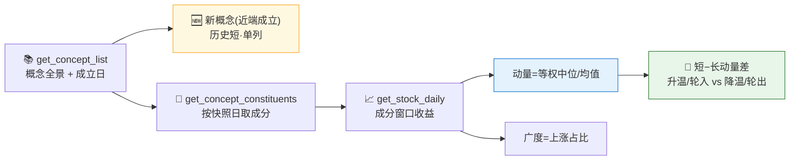

# 🔥 Concept Rotation Monitor Skill

**简体中文** | [English](README.en.md)

> 社区状态：Draft（社区草案） · 创建者/维护者：[`abgyjaguo`](https://github.com/abgyjaguo)

> A股**概念题材热度轮动监控**：把每个概念的**成分股日涨跌**用 `get_stock_daily` 聚合成概念级**动量**与**广度**排名、识别**新成立概念**、比较**短/长窗口动量**看题材在**升温**还是**降温** —— 全市场概念榜或单概念下钻，每个数据点标注来源接口、成分快照日与聚合口径。

<p align="center">
  
  
  
  
  
  
</p>

---

## 📖 这是什么

`concept-rotation-monitor` 是一个 **Agent Skill**：以**概念题材**为中心，回答"**最近哪些题材在升温、是普涨还是少数拉动、哪些在轮出、有没有新概念冒出来**"。

**没有官方的概念价格指数** —— 概念信号一律**自下而上**从成分股日涨跌算出来：`get_concept_list`（概念全景 + 成立日期识别新概念）→ `get_concept_constituents`（**按快照日**取成分，避免用今天的成分算过去的收益 = 前视）→ `get_stock_daily`（成分窗口收益）。**动量** = 成分收益的等权聚合（默认**中位数**稳健，或等权均值，须标注口径与窗口）；**广度** = 上涨成分占比（区分普涨 vs 少数拉动）；**轮动信号** = 短窗−长窗动量差（短≫长=升温/轮入，短≪长=降温/轮出）。一只股票同属多个概念，概念动量**相关且不可加**。

> 数据契约一律来自姊妹技能 [`pandadata-api`](https://github.com/quantskills/skill-pandadata-api)；本技能负责"查什么、怎么聚合动量、怎么定快照、怎么读轮动"，不负责"接口长什么样"。

---

## 🧭 与同生态技能的边界（避免撞车）

| 技能 | 视角 | 何时用 |
|---|---|---|
| 🔥 **concept-rotation-monitor**（本技能） | **概念题材轮动**（多窗口动量时间序列） | "哪些题材在升温""概念动量排名""题材轮入/轮出""有没有新概念" |
| 📈 `market-daily-review` | 每日全市场复盘（当日热点概念一节） | 想要当日盘后复盘 → 移交它 |
| 🔎 `stock-screener` | 自然语言**选股**（概念只是过滤条件） | 想在某题材内按基本面筛股 → 移交它 |
| 📊 `index-valuation-rotation` | 标准**行业/指数**估值分位 + 行业动量 | 想看行业估值温度计 → 移交它（行业 vs 题材，互补） |

---

## 🧬 概念轮动模型（分析前必读）



- **动量**：`median/mean` of 成分窗口收益（等权，默认中位数稳健），须标口径与窗口；无官方概念指数。
- **成分快照**：`get_concept_constituents` 传 `date=`，用当期成分算当期收益，避免前视/幸存者偏差。
- **广度**：上涨成分占比；高动量+低广度=少数个股拉动。
- **轮动信号**：短窗（如 5D）− 长窗（如 20D）动量差。
- **概念重叠**：一股属多概念，动量相关不可加，热门龙头会抬高其所在的每个概念。

---

## 🗂️ 报告章节 × 接口映射

| 章节 | 接口 | 回答什么 |
|---|---|---|
| 🗺️ **概念全景** | `get_concept_list` | 概念数、成分数分布、新成立概念 |
| 🏆 **动量排名** | `get_concept_constituents` + `get_stock_daily` | 哪些概念按窗口动量领先 |
| 📶 **广度对照** | `get_stock_daily`（逐成分） | 普涨还是少数拉动 |
| 🔄 **轮动信号** | 短窗 vs 长窗动量 | 哪些题材在加速轮入/减速轮出 |
| 🆕 **新概念雷达** | `get_concept_list`（`date`） | 近端成立、历史短需单列 |
| 🧩 **概念成分** | `get_concept_constituents` | 某概念背后的成分（带快照日） |

---

## 🚀 快速开始

### 1️⃣ 安装（与 pandadata-api 一起）

```bash
# Claude Code（全局）
cp -r skill-pandadata-api            ~/.claude/skills/pandadata-api
cp -r skill-concept-rotation-monitor ~/.claude/skills/concept-rotation-monitor

# Codex（全局，Agent Skills 标准目录）
mkdir -p ~/.agents/skills
cp -r skill-pandadata-api            ~/.agents/skills/pandadata-api
cp -r skill-concept-rotation-monitor ~/.agents/skills/concept-rotation-monitor

# Cursor（项目级）
mkdir -p .cursor/skills
cp -r skill-pandadata-api            .cursor/skills/pandadata-api
cp -r skill-concept-rotation-monitor .cursor/skills/concept-rotation-monitor
```

### 2️⃣ 直接用自然语言提问

```text
最近 5 日哪些概念题材在升温？给我动量排名和广度对照
帮我看看短−长窗口的轮动信号，哪些在轮入哪些在轮出
最近有没有新成立的概念？单独列出来
英伟达概念 现在的成分和动量怎么样
设置一个每交易日盘后自动跑的概念轮动监控任务
```

### 3️⃣ 报告结构（8 章）

```
摘要 → 概念全景 → 动量排名 → 广度对照
→ 轮动信号 → 新概念雷达 → 风险提示 → 数据说明
```

数据说明为表格：`数据模块 | 来源接口 | 查询窗口 | 成分快照日 | 动量口径/窗口 | 覆盖概念/成分数 | 剔除数 | 备注`。

---

## ⏰ 定时（可选）

在交易日盘后（建议 `18:00 Asia/Shanghai` 之后）运行。任务幂等：`reports/concept-rotation/<scope>-<date>.md` 已存在则覆盖重写；非交易日跳过。

---

## 📦 目录结构

```
concept-rotation-monitor/
├── SKILL.md                            # 技能入口：定位边界、概念轮动模型、工作流、接口映射、分析模式、规则、自动化
├── references/
│   └── concept-rotation-playbook.md    # 📒 路由表、自下而上聚合公式、口径/广度定义、成分快照规则、报告骨架、空数据处理、QA清单
├── scripts/
│   └── validate_report.py              # ✅ 校验报告章节/来源标注/聚合口径/成分时点与概念重叠/窗口/免责声明
└── agents/
    ├── cursor-rule.mdc                 # Cursor 适配
    ├── openai.yaml                     # OpenAI/Codex 适配
    └── portable-loader.md              # Claude Code/Hermes/OpenClaw 适配
```

---

## 📐 核心约束

| 约束 | 说明 |
|---|---|
| 🧾 先查契约 | 所有调用先经 `pandadata-api` 核对三接口参数字段 |
| 🧮 动量须标口径 | 概念动量自下而上等权(中位/均值)计算，须标口径与窗口，无官方概念指数 |
| 📅 成分按快照日 | `get_concept_constituents` 传 `date=`，避免用今天成分算过去收益（前视） |
| 📶 动量旁列广度 | 高动量+低广度=少数拉动，须并列广度 |
| 🧩 概念重叠不可加 | 一股属多概念，动量相关不可加，龙头不作独立敞口 |
| 🆕 新概念单列 | 近端成立概念历史短，不与成熟概念同榜比较 |
| 🕳️ 空数据如实报 | 无数据/样本不足保留标题写明"无数据/样本不足 + 方法/窗口" |
| 🗣️ 措辞克制 | 用"题材升温/降温""轮入/轮出""广度偏窄"，不下涨跌结论，不用买卖语言 |

---

## ⚠️ 免责声明

本报告基于公开数据与规则化分析生成，仅供研究参考，不构成任何投资建议。

## 📜 License

This project is licensed under the GNU General Public License v3.0. See [LICENSE](LICENSE).

## 🐼 PandaAI / QUANTSKILLS 社群

<div align="center">
  
  <br>
  <sub>扫码加入 PandaAI 社群，交流 QUANTSKILLS 技能、Agent 工作流与量化研究实践。</sub>
</div>
