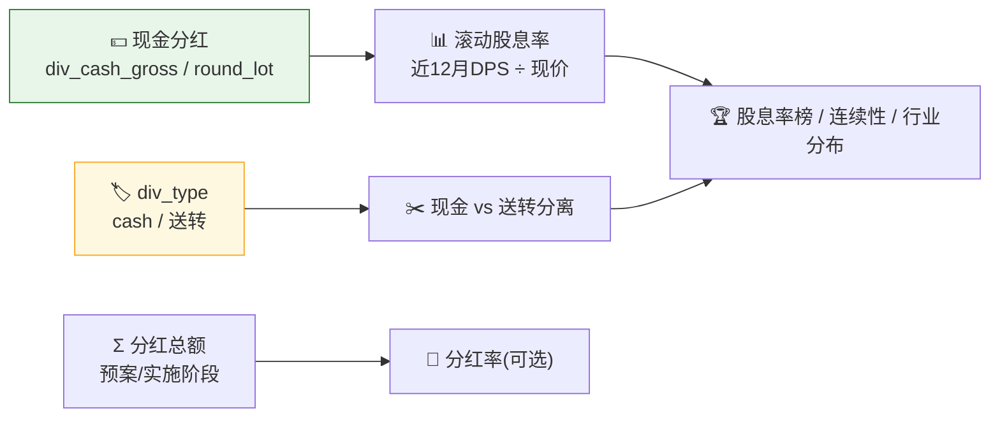

# 💰 Dividend Yield Scan Skill

**简体中文** | [English](README.en.md)

> 社区状态：Draft（社区草案） · 创建者/维护者：[`abgyjaguo`](https://github.com/abgyjaguo)

> A股**高股息与分红质量横截面**：基于现金分红/分红/分红总额/拆分接口，计算**滚动股息率**并排行、衡量**连续分红年数**与稳定性、**区分现金分红与送转**、列示**除权除息日历**、按行业聚合 —— 全市场或篮子，每个数据点标注来源接口与分红日期。

<p align="center">
  
  
  
  
  
  
</p>

---

## 📖 这是什么

`dividend-yield-scan` 是一个 **Agent Skill**：以**分红/股息**为中心扫描 A 股，回答"**谁的股息率高、连续分了几年、是真现金还是送转、什么时候除权除息**"。

它把四个接口拼起来：`get_stock_cash_dividend`（现金分红→股息率）、`get_stock_dividend`（`div_type`→现金/送转）、`get_stock_dividend_amount`（分红总额+预案/实施阶段）、`get_stock_split`（送转/拆分口径）。

> ⚠️ **一个关键坑**：`div_cash_gross` 是**每 `round_lot`（通常 10 股）**的税前现金分红，**每股 = `div_cash_gross` / `round_lot`**。忘记除会把股息率放大 10 倍。数据契约一律来自姊妹技能 [`pandadata-api`](https://github.com/quantskills/skill-pandadata-api)。

---

## 🧭 与同生态技能的边界（避免撞车）

| 技能 | 视角 | 何时用 |
|---|---|---|
| 💰 **dividend-yield-scan**（本技能） | **分红/高股息横截面**（股息率·连续性·现金vs送转） | "股息率排行""高股息名单""连续分红几年""红利质量" |
| 🔎 `stock-screener` | 自然语言多条件选股（"连续分红"只是其中一个过滤位） | 想把分红与北向/质押/行业等**其它条件**组合筛选 → 移交它 |
| 🩺 `a-share-stock-dossier` | 单票深度尽调（分红只是其中一小节） | 想看某公司完整体检 → 移交它 |
| 📈 `index-valuation-rotation` | 指数估值分位/行业动量 | 估值/轮动视角，与红利风格互补 → 移交它 |

---

## 🧬 分红模型（分析前必读）



- **股息率口径**：每股 = `div_cash_gross` / `round_lot`；滚动股息率 = 近 12 月现金 DPS ÷ 现价（`get_stock_daily`），须标窗口+价格日+"仅现金、不含送转"。
- **现金 vs 送转**：`transferred/bonus share` 不是现金回报，绝不计入现金股息率。
- **预案 ≠ 已派**：`get_stock_dividend_amount` 的 `event_stage`（预案/方案实施）须标注。
- **股息率是后视**：基于已派/已宣分红，不是预测。

---

## 🗂️ 报告章节 × 接口映射

| 章节 | 接口 | 回答什么 |
|---|---|---|
| 📋 **分红事件总览** | `get_stock_cash_dividend`·`get_stock_dividend` | 范围内分红、现金 vs 送转占比 |
| 🏆 **股息率榜** | `get_stock_cash_dividend`（÷`round_lot`）+ `get_stock_daily` | 滚动股息率最高 |
| 🔁 **连续分红与稳定性** | `get_stock_cash_dividend`（多年） | 连续分红年数、稳定性 |
| ✂️ **现金分红 vs 送转** | `get_stock_dividend`（`div_type`） | 哪些"分红"是真现金 |
| 📅 **除权除息日历** | `get_stock_cash_dividend`（`ex_date`） | 未来除权除息排期 |
| 📐 **分红率（可选）** | `get_stock_dividend_amount` + 财报 | 分红总额 / 净利润 |
| 🏭 **行业分布** | `get_stock_industry` + 上述 | 哪些行业派现最多 |

---

## 🚀 快速开始

### 1️⃣ 安装（与 pandadata-api 一起）

```bash
# Claude Code（全局）
cp -r skill-pandadata-api      ~/.claude/skills/pandadata-api
cp -r skill-dividend-yield-scan ~/.claude/skills/dividend-yield-scan

# Codex（全局，Agent Skills 标准目录）
mkdir -p ~/.agents/skills
cp -r skill-pandadata-api      ~/.agents/skills/pandadata-api
cp -r skill-dividend-yield-scan ~/.agents/skills/dividend-yield-scan

# Cursor（项目级）
mkdir -p .cursor/skills
cp -r skill-pandadata-api      .cursor/skills/pandadata-api
cp -r skill-dividend-yield-scan .cursor/skills/dividend-yield-scan
```

### 2️⃣ 直接用自然语言提问

```text
给我一份全市场股息率榜，只看现金分红、标注口径
沪深300里连续分红最久、股息率最高的名单
600519.SH 的分红历史：每年现金 DPS、现金还是送转、除权除息日
最近有哪些高股息但其实以送转为主的票？帮我区分开
未来一个月的除权除息日历
```

### 3️⃣ 报告结构（9 章）

```
摘要 → 分红事件总览 → 股息率榜 → 连续分红与稳定性 → 现金分红 vs 送转
→ 除权除息日历 → 分红率(可选) → 行业分布 → 数据说明
```

数据说明为表格：`数据模块 | 来源接口 | 查询窗口 | 滚动窗口/价格日 | 返回行数 | 备注`。

---

## ⏰ 定时（可选）

分红披露集中在年报/中报期，建议在**分红季**周度运行，或交易日盘后运行。任务幂等：`reports/dividend/<scope>-<date>.md` 已存在则覆盖重写；依赖价格的运行跳过非交易日。

---

## 📦 目录结构

```
dividend-yield-scan/
├── SKILL.md                      # 技能入口：定位边界、分红模型、股息率口径、工作流、接口映射、规则、自动化
├── references/
│   └── dividend-playbook.md      # 📒 路由表、股息率/连续性/现金vs送转口径、round_lot 坑、报告骨架、空数据处理、QA清单
├── scripts/
│   └── validate_report.py        # ✅ 校验报告章节/来源标注/股息率口径(round_lot)/现金vs送转/窗口/免责声明
└── agents/
    ├── cursor-rule.mdc           # Cursor 适配
    ├── openai.yaml               # OpenAI/Codex 适配
    └── portable-loader.md        # Claude Code/Hermes/OpenClaw 适配
```

---

## 📐 核心约束

| 约束 | 说明 |
|---|---|
| 🧾 先查契约 | 所有调用先经 `pandadata-api` 核对分红接口参数字段（尤其 `round_lot`） |
| ➗ 每股要除基准 | 每股现金 = `div_cash_gross` / `round_lot`，报告须注明，避免 10 倍错误 |
| 📊 股息率带口径 | 每个股息率标注滚动窗口、价格日、"仅现金不含送转" |
| ✂️ 现金送转分离 | 送转非现金回报，绝不计入现金股息率 |
| 📝 预案≠已派 | `get_stock_dividend_amount` 的预案/实施阶段须标注 |
| 🔭 后视非预测 | 股息率基于已派/已宣分红，不是预测 |
| 🕳️ 空数据如实报 | 无分红保留标题写明"无数据 + 方法/窗口" |
| 🗣️ 措辞克制 | 用"滚动股息率较高""连续 N 年现金分红""以送转为主"，不下涨跌结论 |

---

## ⚠️ 免责声明

本报告基于公开数据与规则化分析生成，仅供研究参考，不构成任何投资建议。

## 📜 License

This project is licensed under the GNU General Public License v3.0. See [LICENSE](LICENSE).

## 🐼 PandaAI / QUANTSKILLS 社群

<div align="center">
  
  <br>
  <sub>扫码加入 PandaAI 社群，交流 QUANTSKILLS 技能、Agent 工作流与量化研究实践。</sub>
</div>
