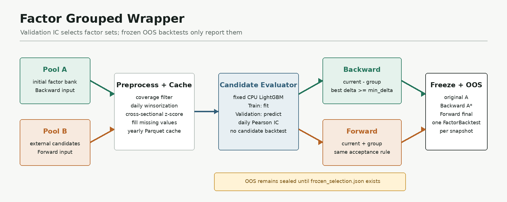
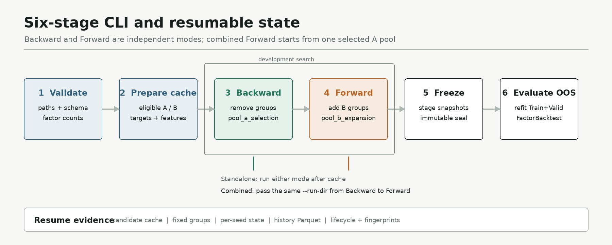

# skill-factor-grouped-wrapper

**简体中文** | [English](README.en.md)

<p align="center">
  
</p>

<p align="center">
  
</p>

`skill-factor-grouped-wrapper` 是面向大规模量化因子库的分组贪心 Wrapper Skill。它固定预处理和 CPU LightGBM 参数，在训练集拟合模型，可按验证期逐日截面 Pearson IC 或扣除交易成本后的对冲 Sharpe 搜索，并保存可恢复的候选、分组和路径状态。

Backward 与 Forward 是两种可独立使用的模式：Backward 从因子池 A 分组剔除因子；Forward 从候选池 B 分组加入因子。当两者组合运行时，所有 Forward 随机种子都从唯一选定的 A 最优集合开始。默认 IC 模式在搜索期间不运行回测；Sharpe 模式会对每个验证期候选调用独立的 `skill-factor-backtest`。两种模式都只在集合冻结后比较原始 A、Backward A* 和 Forward final 的样本外表现。

`role: skill` `platforms: codex / claude-code / cursor / hermes / openclaw` `category: factor` `status: active` `maintainer: community` `validation: runnable` `model: LightGBM` `search metric: Pearson IC or hedged Sharpe`

本项目是由 X-Tech-group 维护的 QUANTSKILLS Community Project，尚未获得 QUANTSKILLS 官方认证、背书或生产可用性确认。`validation: runnable` 仅表示仓库测试和合成 smoke 流程通过。

## 运行时入口

| 平台 | 入口 | 状态 |
| --- | --- | --- |
| Codex | `SKILL.md`、`agents/openai.yaml` | 已完成本地运行验证 |
| Claude Code | `SKILL.md`，必要时使用 `agents/portable-loader.md` | 已提供标准入口 |
| Cursor | `agents/cursor-rule.mdc` | 已提供适配入口 |
| Hermes | `agents/portable-loader.md` | 已提供适配入口 |
| OpenClaw | `SKILL.md` 或 `agents/portable-loader.md` | 已提供通用入口 |

除 Codex 本地执行外，其余平台入口用于加载同一套 CLI 和契约，不表示已完成各平台端到端认证。

## 解决的问题

- 大规模因子逐个增删需要训练过多模型，分组候选可降低搜索次数。
- 单条随机路径容易受分组影响，多随机种子保留路径差异和因子存活频率。
- 长流程中断后容易丢失进度，候选结果、路径状态和固定分组均可复用。
- IC 与 Sharpe 是可切换的验证期筛选指标；无论采用哪种指标，冻结后 OOS 回测都不反馈到选择过程。
- 因子池 A 的压缩和候选池 B 的扩张可以分别执行，也可以在同一 run 中衔接。

## 六阶段工作流

```text
validate
  -> prepare-cache
  -> search-backward     # 可选模式一
  -> search-forward      # 可选模式二，可独立或承接 Backward
  -> freeze
  -> evaluate-oos        # 每个冻结快照调用一次 FactorBacktest
```

搜索阶段使用：

```text
Train:      固定 LightGBM 拟合
Validation: 按配置使用逐日截面 Pearson IC 或扣费对冲 Sharpe 比较候选
OOS:        保持封存，不参与因子、随机种子或参数选择
```

默认研究模板为 2010-2021 训练、2022 验证、2023-2026-01 OOS；日期由 YAML 配置决定，不写死在代码中。

## 输入

### 因子池 A 和候选池 B

因子库使用长表主键和宽因子列，可提供单个 Parquet 或目录型 Parquet dataset：

```text
date | ticker | alpha191_001 | alpha191_002 | ...
```

- `data.factor_bank`：必需，因子池 A。
- `data.external_factor_bank`：可选，候选池 B，仅 Forward 使用。
- `initial_factors` / `external_factors`：可显式限定列；为 null 时使用全部非主键列。
- A、B 因子名不得重复。

### 市场数据

`data.market_data_root` 必须与 `skill-factor-backtest` 的 `BackTestData_pq` 结构一致。Wrapper 使用 `trade_price.parquet` 构造下一交易日执行的一日远期收益标签；Sharpe 搜索和 OOS 阶段由 FactorBacktest 使用完整数据根目录。

完整字段与预处理规则见 [输入契约](references/input_schema.md)。

## 安装

推荐在 Python 3.11 环境中安装：

```bash
python -m pip install -e .
```

或安装运行依赖：

```bash
python -m pip install -r requirements.txt
```

Sharpe 搜索和 OOS 回测还需要可访问的 `skill-factor-backtest`。可在 YAML 中设置 `backtest.skill_root`，也可使用环境变量 `FACTOR_BACKTEST_SKILL_ROOT`。

## 配置

复制 [完整配置模板](examples/config.yaml)，修改因子库、市场数据和输出路径。模板展示 A+B 组合流程：

```yaml
data:
  factor_bank: /path/to/alpha191.parquet
  external_factor_bank: /path/to/alpha101_factormad.parquet

selection:
  primary_metric: mean_ic
  min_delta: 0.001
  forward_enabled: true
```

改用验证期扣费对冲 Sharpe 时，将选择段改为：

```yaml
selection:
  primary_metric: sharpe
  min_delta: 0.05
  forward_enabled: true
```

只运行 Backward 时，将 `external_factor_bank` 设为 null、`forward_enabled` 设为 false。只运行 Forward 时保留 B 和 `forward_enabled: true`，完成 cache 后直接执行 `search-forward`。

`grouping.source_prefixes` 必须与真实列名前缀完全一致。例如 `alpha191_001` 应配置 `alpha191_`。

## 运行

先校验并准备一次可复用开发缓存：

```bash
python scripts/run_factor_grouped_wrapper.py --config /path/to/config.yaml validate
python scripts/run_factor_grouped_wrapper.py --config /path/to/config.yaml prepare-cache
```

组合运行：

```bash
python scripts/run_factor_grouped_wrapper.py --config /path/to/config.yaml search-backward
python scripts/run_factor_grouped_wrapper.py --config /path/to/config.yaml search-forward --run-dir /path/to/run
python scripts/run_factor_grouped_wrapper.py --config /path/to/config.yaml freeze --run-dir /path/to/run
python scripts/run_factor_grouped_wrapper.py --config /path/to/config.yaml evaluate-oos --run-dir /path/to/run
```

`search-backward` 的 stdout JSON 会返回新建的 `run_dir`。后续阶段必须使用该目录。中断后用同一配置和 `--run-dir` 重跑当前搜索命令；已完成候选会按 fingerprint 复用。

`evaluate-oos` 已完成后默认拒绝覆盖；只有明确需要重跑时才使用 `--force`。增加 `--report` 会要求 FactorBacktest 生成 PDF 报告。

## 搜索逻辑

Backward 在每轮评估所有 `current - group`，只接受主指标提升至少 `min_delta` 的最佳组；当前 stage 无提升后进入更细 stage。Forward 在每轮评估所有 `current + group`，使用相同接受规则，直至没有候选组通过门槛。

每个 seed 的固定分组先按 `source_prefixes` 分桶，再确定性打乱并平衡放入组中。组在同一 stage 内不会因一次接受而重新随机。同一轮候选可由 `runtime.candidate_workers` 并行，独立 seed 路径可由 `runtime.seed_workers` 并行；每条路径内依赖前序结果的迭代仍顺序执行。多 seed 完成后按主指标及诊断指标选择唯一最佳路径；存活频率只作为诊断，不自动投票生成集合。

算法细节见 [算法说明](references/algorithm.md)。

## 输出

稳定开发结果：

- `pool_a_selection.json`：Backward 的 A 输入、保留、删除、最佳 seed 和验证指标。
- `pool_b_expansion.json`：Forward 的 A 基础、B 候选、加入、拒绝和前后指标。
- `final_factor_pool.json`：最后开发集合，可直接交给后续流程。
- `frozen_selection.json`：冻结的原始 A、Backward A*、Forward final 快照。
- `oos_comparison.json`：所有冻结快照的 OOS 回测结果和相邻阶段指标差值。

IC 模式的组合 OOS 阶段通常产生三个 FactorBacktest 调用；Sharpe 模式还会为每个验证候选产生一次调用。Backward-only 或 Forward-only 产生两个。即使两个阶段的因子列表相同，它们仍作为不同阶段快照分别记录。

字段级定义见 [输出契约](references/output_contract.md)，FactorBacktest 参数和指标解析见 [回测集成说明](references/factor-backtest-integration.md)。

## Smoke 验证

仓库不提交真实因子或行情数据。下面的命令生成小型合成 fixture，并自动运行到 `freeze`：

```bash
python scripts/run_smoke.py
```

需要逐阶段检查时，先单独生成数据：

```bash
python scripts/make_smoke_fixture.py
python scripts/run_factor_grouped_wrapper.py --config examples/smoke_config.yaml validate
python scripts/run_factor_grouped_wrapper.py --config examples/smoke_config.yaml prepare-cache
python scripts/run_factor_grouped_wrapper.py --config examples/smoke_config.yaml search-backward
```

使用最后一条命令返回的 `run_dir` 继续执行 `search-forward` 和 `freeze`。两种 Smoke 用法都只验证开发流程，不调用 OOS FactorBacktest，也不代表因子有效。

## 仓库结构

```text
├── SKILL.md
├── README.md / README.en.md
├── agents/
├── examples/
├── pipeline/
├── references/
├── scripts/
│   └── factor_grouped_wrapper/
└── tests/
```

## 当前边界

- 当前版本只支持 CPU LightGBM，不支持 MLP。
- 独立 seed 路径和同一轮候选分别可由 `runtime.seed_workers` 与 `runtime.candidate_workers` 并行；每条路径内依赖前序结果的迭代顺序执行。LightGBM 使用 `model.n_jobs`，回测子进程线程由 `runtime.backtest_threads` 限制；`runtime.preload_features` 可用更高内存占用减少重复读取。
- 搜索使用单一验证期，不是时间序列交叉验证。
- Greedy 分组搜索可能遗漏联合有效的组合，也可能过拟合验证期。
- Pearson IC 与 Sharpe 优化可能选择不同集合；单一验证期 Sharpe 也可能因重复比较而过拟合。
- 结果仅用于量化研究，不构成投资建议、收益承诺或生产交易验证。

更多限制见 [验证说明](references/validation_notes.md) 和 [数据来源边界](references/source_boundary.md)。

## 社区与研究边界

| 项目 | 声明 |
| --- | --- |
| 数据来源 | 仓库不附带真实因子或行情数据；只接受用户有权使用的数据。 |
| 示例数据 | Smoke fixture 完全由脚本合成，只验证机械流程，不证明因子质量。 |
| 假设与参数 | 以 `examples/config.yaml`、`references/input_schema.md` 和实际代码校验为准。 |
| 已知限制 | 当前为 LightGBM-only、单验证期、支持 seed 路径与轮内候选并行的分组贪心搜索；路径内迭代仍顺序执行。 |
| 风险边界 | 输出仅用于研究，不构成投资建议、收益承诺、官方背书或生产交易验证。 |

## 第三方依赖与归因

本仓库通过依赖调用 [LightGBM](https://github.com/microsoft/LightGBM)（MIT）、[NumPy](https://github.com/numpy/numpy)（BSD-3-Clause）、[pandas](https://github.com/pandas-dev/pandas)（BSD-3-Clause）、[Apache Arrow / PyArrow](https://github.com/apache/arrow)（Apache-2.0）和 [PyYAML](https://github.com/yaml/pyyaml)（MIT），并通过公开 CLI 调用独立的 [skill-factor-backtest](https://github.com/quantskills/skill-factor-backtest)（GPLv3）。各项目分别遵循其自身许可证；本仓库不内嵌这些项目的源码。

`Alpha101`、`Alpha191` 和 `FactorMAD` 只作为用户可提供的因子库命名示例或外部候选来源。本仓库不重新分发其真实因子值、公式、数据集或第三方研究产物。

## License

GPL-3.0-only，见 [LICENSE](LICENSE)。
