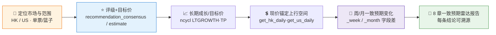

# 📊 HK/US Consensus Radar Skill

**简体中文** | [English](README.en.md)

> 社区状态：Draft（社区草案） · 创建者/维护者：[`abgyjaguo`](https://github.com/abgyjaguo)

> 港美股**卖方一致预期雷达**：评级分布（强买/买/持有/卖/强卖）、目标价相对现价的上行空间、长期成长预期、周/月一致预期变化 —— 单票或篮子，每个数值标注来源接口、市场、货币与数据日。

<p align="center">
  
  
  
  
  
  
</p>

---

## 📖 这是什么

`hk-us-consensus-radar` 是一个 **Agent Skill**：读取港美股**卖方分析师一致预期**，回答"**分析师现在怎么看这些港美股**"——买入/持有/卖出评级如何分布、一致目标价相对现价还有多少上行空间、长期成长预期多高、过去一周/一月评级与目标价被上调还是下调。

它读的是"**分析师怎么想**"（`get_stock_recommendation_*` / `get_stock_ncycl_*`），与姊妹技能 `hk-us-quote-scan` 读的"**市场怎么走**"（价、量、估值）正好互补。现价只用于锚定目标价上行空间，不做行情分析。每个结论标注来源接口、市场、货币与数据日；一致预期是**某一时点的分析师观点快照**，不是价格预测，也不是公司自己的业绩指引。

> 数据契约一律来自姊妹技能 [`pandadata-api`](https://github.com/quantskills/skill-pandadata-api)；本技能负责"查什么、怎么算"，不负责"接口长什么样"。

---

## 🧭 与同生态技能的边界（避免撞车）

| 技能 | 读什么 / 市场 | 何时用 |
|---|---|---|
| 📊 **hk-us-consensus-radar**（本技能） | **港美股 卖方一致预期**（评级/目标价/成长/修正） | "港股/美股一致预期""目标价上行空间""近一月评级上调没" |
| 🌏 `hk-us-quote-scan` | **港美股 行情/流动性/估值** | 想看价、量、估值相对行业位 → 与本技能**互补**（观点 × 价量） |
| 📅 `earnings-season-tracker` | **A 股 公司自发业绩预告** | A 股财报季公司自己的预增预减 → 移交它（不同来源/市场） |
| 🩺 `a-share-stock-dossier` / 🔎 `stock-screener` | **A 股** | A 股个股/选股 → 移交它（本 SDK 一致预期接口为港美股族） |

---

## 🗺️ 市场分流（重要）

一致预期数据按市场拆分：**方法名不同、字段结构相同**。切勿用港股方法查美股或反之。

| 市场 | 评级+目标价 | 非周期指标（成长/目标价） | 现价锚定 |
|---|---|---|---|
| 香港 | `get_stock_recommendation_consensus` | `get_stock_ncycl_consensus` | `get_hk_daily` |
| 美国 | `get_stock_recommendation_estimate` | `get_stock_ncycl_estimate` | `get_us_daily` |

---

## ⚡ 分析流水线



---

## 🗂️ 报告章节 × 接口映射

| 章节 | 港股接口 | 美股接口 | 回答什么 |
|---|---|---|---|
| ⭐ **评级分布** | `get_stock_recommendation_consensus` | `get_stock_recommendation_estimate` | 强买/买/持有/卖/强卖计数、买入占比、净评级 |
| 💲 **目标价与上行空间** | 上者 + `get_hk_daily` | 上者 + `get_us_daily` | 一致目标价（均值/中位/高/低）与相对现价上行空间 |
| 🌱 **长期成长预期** | `get_stock_ncycl_consensus`（`LTGROWTH`） | `get_stock_ncycl_estimate`（`LTGROWTH`） | 未来 3–5 年成长预期与分歧 |
| 🔍 **覆盖广度与分歧** | 两族接口（`estimates_num`、`std`） | 同 | 多少分析师覆盖、一致程度松紧 |
| 🔁 **一致预期变化** | `_week` / `_month` 后缀字段 | 同 | 近窗口评级迁移与目标价修正 |

---

## 🚀 快速开始

### 1️⃣ 安装（与 pandadata-api 一起）

```bash
# Claude Code（全局）
cp -r skill-pandadata-api         ~/.claude/skills/pandadata-api
cp -r skill-hk-us-consensus-radar ~/.claude/skills/hk-us-consensus-radar

# Codex（全局，Agent Skills 标准目录）
mkdir -p ~/.agents/skills
cp -r skill-pandadata-api         ~/.agents/skills/pandadata-api
cp -r skill-hk-us-consensus-radar ~/.agents/skills/hk-us-consensus-radar

# Cursor（项目级）
mkdir -p .cursor/skills
cp -r skill-pandadata-api         .cursor/skills/pandadata-api
cp -r skill-hk-us-consensus-radar .cursor/skills/hk-us-consensus-radar
```

### 2️⃣ 直接用自然语言提问

```text
0700.HK 的卖方一致预期怎么样？目标价还有多少上行空间？
帮我把这几只美股按净评级和目标价上行空间排个序
AAPL 的评级近一个月是被上调还是下调？覆盖它的分析师有多少？
这只港股的长期成长预期和分歧有多大？
```

### 3️⃣ 报告结构（8 章）

```
摘要 → 评级分布 → 目标价与上行空间 → 长期成长预期
→ 覆盖广度与分歧 → 一致预期变化 → 风险提示 → 数据说明
```

---

## 📦 目录结构

```
hk-us-consensus-radar/
├── SKILL.md                        # 技能入口：定位边界、市场分流、字段模型、工作流、接口映射、分析模式、规则
├── references/
│   └── consensus-playbook.md       # 📒 路由表、指标口径、市场分流与后缀说明、报告骨架、空数据处理、QA清单
├── scripts/
│   └── validate_report.py          # ✅ 校验报告章节/来源标注/市场货币/上行空间基准/覆盖广度/免责声明
└── agents/
    ├── cursor-rule.mdc             # Cursor 适配
    ├── openai.yaml                 # OpenAI/Codex 适配
    └── portable-loader.md          # Claude Code/Hermes/OpenClaw 适配
```

---

## 📐 核心约束

| 约束 | 说明 |
|---|---|
| 🧾 先查契约 | 所有调用先经 `pandadata-api` 核对参数字段与可用 `_week/_month` 后缀 |
| 🗺️ 市场分流 | 港股用 `_consensus`，美股用 `_estimate`，不跨市场混用 |
| 💲 上行空间要基准 | 每个上行空间写明目标价口径（均值/中位）与现价日期，两侧同币种 |
| 🔍 覆盖广度必报 | 一致预期旁必附覆盖分析师数，薄覆盖须提示，不高估 |
| 🌱 指标不混 | `LTGROWTH` 与 `TP` 分开呈现，不混算 |
| 🧠 观点非预测 | 一致预期是分析师观点快照，不是价格预测，不是公司业绩指引 |
| 🕳️ 无覆盖如实报 | 小盘/次新常无覆盖，保留标题写明"无覆盖 / 无数据 + 方法/标的" |
| 🗣️ 措辞克制 | 用"一致预期偏多/偏空""近一月上调"，不下涨跌结论，不用买卖语言 |

---

## ⚠️ 免责声明

本报告基于公开数据与规则化分析生成，仅供研究参考，不构成任何投资建议。

## 📜 License

This project is licensed under the GNU General Public License v3.0. See [LICENSE](LICENSE).

## 🐼 PandaAI / QUANTSKILLS 社群

<div align="center">
  
  <br>
  <sub>扫码加入 PandaAI 社群，交流 QUANTSKILLS 技能、Agent 工作流与量化研究实践。</sub>
</div>
