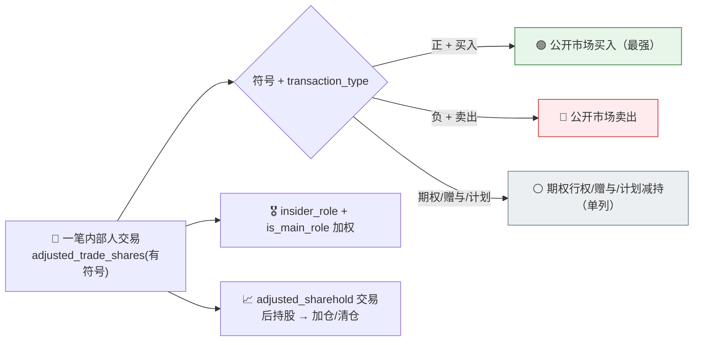

# 🕵️ HK/US Insider Radar Skill

**简体中文** | [English](README.en.md)

> 港股/美股**内部人（董监高/大股东）交易信号雷达**：区分**公开市场买入 vs 卖出**与**期权行权/赠与/计划减持**、按**内部人身份**（董事/CEO/CFO/大股东）与 `is_main_role` 加权、窗口内按**股数与金额**净额聚合、标记**聚集买入/卖出**与**持股变化轨迹**、按净内部人方向排榜 —— 单票或自选清单，每个结论标注来源接口、申报/交易日与币种。

<p align="center">
  
  
  
  
  
  
</p>

---

## 📖 这是什么

`hk-us-insider-radar` 是一个 **Agent Skill**：读港股 `get_stock_insider_trade` 与美股 `get_stock_insider_transaction`，回答"**最近谁在用自己的钱买入自家股票、谁在卖、董事高管还是边缘持有人、是加仓还是清仓、有没有多人聚集买入**"。

两个接口**字段一致**、**一笔交易一行**（`symbol`+`investor_name`+`transaction_date`）。**方向不是独立字段** —— 用 `adjusted_trade_shares` 的**符号**（负=卖、正=买）配合 `transaction_type` 判定；`transaction_type`/`acquisition_type` 还要把**公开市场买卖**与**期权行权、赠与继承、计划内减持**分开，公开市场买入（尤其董事/CEO 现金买入）信号最强。`insider_role`+`is_main_role` 标注**谁在交易**；`adjusted_sharehold` 给出**交易后持股**看加仓/清仓。`info_date`（申报日）≠ `transaction_date`（交易日），存在申报滞后。

> 数据契约一律来自姊妹技能 [`pandadata-api`](https://github.com/quantskills/skill-pandadata-api)；本技能负责"查什么、怎么分类方向/类型、怎么加权、怎么净额排榜"，不负责"接口长什么样"。

---

## 🧭 与同生态技能的边界（避免撞车）

| 技能 | 视角 | 何时用 |
|---|---|---|
| 🕵️ **hk-us-insider-radar**（本技能） | 港股/美股**内部人交易**信号 | "看看内部人在买还是卖""董事高管有没有聚集增持""某票内部人净买入" |
| 💹 `hk-us-quote-scan` | 港美股**价量/估值**快照 | 想看行情与估值 → 移交它（本技能只做内部人信号，价格仅作情景） |
| 🔮 `hk-us-consensus-radar` | **卖方分析师**一致预期/评级 | 想看街上怎么看 → 移交它（内部人 ≠ 分析师，常反向） |
| 🚨 `event-risk-alert` | A股自选/持仓风险事件（解禁/质押/减持） | A股减持监控 → 移交它（本技能覆盖港美股，数据模型不同） |

---

## 🧬 内部人交易模型（分析前必读）



- **头条净额只算公开市场买卖**：期权行权/赠与/计划减持单列，绝不混入净额。
- **方向**：`adjusted_trade_shares` 符号 + `transaction_type` 双重判定，不用价格或持股倒推。
- **加权**：董事/CEO/CFO/大股东为高权重；`is_main_role=1` 为多内部人申报中的主要人物。
- **申报滞后**：窗口按 `info_date`（申报日），`transaction_date`（交易日）在前。
- **币种**：金额按 `currency`（港元/美元）分列，不跨币种相加。

---

## 🗂️ 报告章节 × 接口映射

| 章节 | 接口 | 回答什么 |
|---|---|---|
| 📋 **内部人交易总览** | `get_stock_insider_trade` / `get_stock_insider_transaction` | 窗口内笔数、内部人数、按币种总交易额 |
| 🧭 **方向与类型分解** | 同上（`transaction_type`·`acquisition_type`·有符号股数） | 公开市场买/卖 vs 期权/赠与/计划；公开市场净额 |
| 🎖️ **身份加权** | 同上（`insider_role`·`is_main_role`） | 董事/CEO/CFO/大股东 vs 边缘人 |
| 🎯 **聚集买入/卖出** | 同上（按人聚合） | 跨内部人聚集 / 单人多笔 |
| 📈 **持股变化** | 同上（`adjusted_sharehold`） | 加仓/减仓/清仓轨迹 |
| 💹 **价格情景（可选）** | `get_stock_pv_indicator` / `get_stock_pv_metric` | 交易发生在什么估值/价格位置 |

---

## 🚀 快速开始

### 1️⃣ 安装（与 pandadata-api 一起）

```bash
# Claude Code（全局）
cp -r skill-pandadata-api        ~/.claude/skills/pandadata-api
cp -r skill-hk-us-insider-radar  ~/.claude/skills/hk-us-insider-radar

# Codex（全局，Agent Skills 标准目录）
mkdir -p ~/.agents/skills
cp -r skill-pandadata-api        ~/.agents/skills/pandadata-api
cp -r skill-hk-us-insider-radar  ~/.agents/skills/hk-us-insider-radar

# Cursor（项目级）
mkdir -p .cursor/skills
cp -r skill-pandadata-api        .cursor/skills/pandadata-api
cp -r skill-hk-us-insider-radar  .cursor/skills/hk-us-insider-radar
```

### 2️⃣ 直接用自然语言提问

```text
0700.HK 最近 90 天内部人在买还是在卖？把公开市场买卖和期权行权分开
AAPL 最近有没有董事/高管聚集增持？给我净买入和持股变化
帮我扫一遍这个港股自选清单的内部人交易，按净买入排个榜
NVDA 内部人最近的减持是计划内还是公开市场卖出？
设置一个每周跑一次的港美股内部人交易雷达任务
```

### 3️⃣ 报告结构（8 章）

```
摘要 → 内部人交易总览 → 方向与类型分解 → 身份加权
→ 聚集买入/卖出 → 持股变化 → 风险提示 → 数据说明
```

数据说明为表格：`数据模块 | 来源接口 | 查询窗口(info_date) | 返回笔数/内部人数 | 币种 | 采用股数字段 | 备注`。

---

## ⏰ 定时（可选）

对自选清单按选定节奏（如每周）运行，按 `info_date` 拉取新申报。任务幂等：`reports/insider/<scope>-<date>.md` 已存在则覆盖重写。港美股申报窗口与 A股不同，用申报日窗口而非交易日历假设。

---

## 📦 目录结构

```
hk-us-insider-radar/
├── SKILL.md                        # 技能入口：定位边界、内部人交易模型、工作流、接口映射、分析模式、规则、自动化
├── references/
│   └── insider-playbook.md         # 📒 路由表、方向/类型分类、身份加权、净额规则、聚集检测、报告骨架、空数据处理、QA清单
├── scripts/
│   └── validate_report.py          # ✅ 校验报告章节/来源标注/类型分类/申报滞后/币种/窗口/免责声明
└── agents/
    ├── cursor-rule.mdc             # Cursor 适配
    ├── openai.yaml                 # OpenAI/Codex 适配
    └── portable-loader.md          # Claude Code/Hermes/OpenClaw 适配
```

---

## 📐 核心约束

| 约束 | 说明 |
|---|---|
| 🧾 先查契约 | 所有调用先经 `pandadata-api` 核对 `get_stock_insider_trade` / `get_stock_insider_transaction` 参数字段 |
| 🧭 类型必分开 | 公开市场买卖为头条净额，期权行权/赠与/计划减持单列，绝不混入 |
| ➕➖ 方向双判定 | 用 `adjusted_trade_shares` 符号 + `transaction_type` 判定方向，不用价格/持股倒推 |
| ⏳ 申报滞后 | 窗口按 `info_date`；`transaction_date` 在前，须说明滞后 |
| 🎖️ 身份不虚构 | 读 `insider_role` 原文，principals 高权重，不编造头衔；`is_main_role=1` 为主要人物 |
| 💱 币种不混加 | 金额按 `currency` 分列，不跨港元/美元相加 |
| 🕳️ 空数据如实报 | 无内部人申报保留标题写明"无数据 + 方法/窗口" |
| 🗣️ 措辞克制 | 用"净买入/净卖出""聚集买入""可能提示内部人增持意愿"，不下涨跌结论，不给买卖指令 |

---

## ⚠️ 免责声明

本报告基于公开数据与规则化分析生成，仅供研究参考，不构成任何投资建议。

## 📜 License

This project is licensed under the GNU General Public License v3.0. See [LICENSE](LICENSE).

维护者：`abgyjaguo`

## 🐼 PandaAI / QUANTSKILLS 社群

<div align="center">
  
  <br>
  <sub>扫码加入 PandaAI 社群，交流 QUANTSKILLS 技能、Agent 工作流与量化研究实践。</sub>
</div>
