# 🌏 HK/US Quote Scan Skill

**简体中文** | [English](README.en.md)

> 社区状态：Draft（社区草案） · 创建者/维护者：[`abgyjaguo`](https://github.com/abgyjaguo)

> 港美股**行情、复权收益、流动性、价量估值与行业相对位**的横截面快照 —— 单票、篮子或全市场，每个数据点标注来源接口、市场、货币与数据日。

<p align="center">
  
  
  
  
  
  
</p>

---

## 📖 这是什么

`hk-us-quote-scan` 是一个 **Agent Skill**：对**港股与美股**标的（单票 / 篮子 / 全市场横截面）做行情估值快照，回答"**这些港美股现在的价、量、估值、相对行业位怎么样**"——区间复权收益、波动率、日均流动性、价量估值指标，以及每个指标相对所属行业/板块中位数的位置。

本技能读取 `get_hk_*` / `get_us_*` / `get_stock_pv_*` / `get_stock_*_median` 这一族港美股接口。每个结论都标注来源接口、市场、货币与数据日；行情是**某一交易日的快照**。

> 数据契约一律来自姊妹技能 [`pandadata-api`](https://github.com/quantskills/skill-pandadata-api)；本技能负责"查什么、怎么算"，不负责"接口长什么样"。

---

## 🧭 与同生态技能的边界（避免撞车）

| 技能 | 市场 / 视角 | 何时用 |
|---|---|---|
| 🌏 **hk-us-quote-scan**（本技能） | **港股 / 美股** 行情估值横截面 | "拉一份港股/美股行情估值快照""这些美股相对行业贵不贵""港美股篮子对比" |
| 📊 `hk-us-consensus-radar` | **港股 / 美股** 卖方一致预期 | 想看分析师评级与目标价 → 与本技能**互补**（价量 × 观点） |
| 📈 `market-daily-review` | **A 股** 全市场盘后复盘 | A 股当日复盘 → 移交它（不覆盖港美股） |
| 🌡️ `index-valuation-rotation` | **A 股** 指数估值分位与行业轮动 | A 股指数估值/轮动 → 移交它（不覆盖港美股） |
| 🩺 `a-share-stock-dossier` | **A 股** 单票深度尽调 | A 股个股深挖 → 移交它 |
| 🗄️ `pandadata-warehouse` | 本地批量缓存 | 港美股大批量重复拉取 → 交它落库后再读 |

---

## ⚡ 扫描流水线

```mermaid
flowchart LR
    A["🎯 定位市场与范围<br/>HK / US · 单票/篮子/全市场"] --> B["🪪 标的与分类<br/>get_hk_detail·get_us_detail"]
    B --> C["📈 行情与流动性<br/>get_hk_daily·get_us_daily"]
    C --> D["🔧 复权收益<br/>+ get_adj_factor"]
    D --> E["💹 价量估值指标<br/>get_stock_pv_indicator·get_stock_pv_metric"]
    E --> F["🏭 行业相对位置<br/>get_stock_industry_median·get_stock_sector_median"]
    F --> G["📝 8 章港美股扫描报告<br/>每条结论可溯源"]

    style A fill:#fff3e0,stroke:#ef6c00
    style C fill:#e3f2fd,stroke:#1976d2
    style F fill:#ede7f6,stroke:#5e35b1
    style G fill:#e8f5e9,stroke:#388e3c
```



---

## 🗂️ 报告章节 × 接口映射

| 章节 | 港股接口 | 美股接口 | 回答什么 |
|---|---|---|---|
| 🪪 **标的与分类** | `get_hk_detail` | `get_us_detail` | 名称、板块/交易所、行业分类、上市状态 |
| 📈 **行情与流动性** | `get_hk_daily` | `get_us_daily` | OHLCV、成交额、VWAP、成交笔数、日均流动性 |
| 🔧 **复权收益** | `get_hk_daily` + `get_adj_factor` | `get_us_daily` + `get_adj_factor` | 复权区间收益与波动率 |
| 💹 **价量估值指标** | `get_stock_pv_indicator` | `get_stock_pv_metric` | 每只标的最新价量/估值指标 |
| 🏭 **行业相对位置** | `get_stock_industry_median` | `get_stock_sector_median` | 各指标相对所属行业/板块中位的位置 |

---

## 🚀 快速开始

### 1️⃣ 安装（与 pandadata-api 一起）

```bash
# Claude Code（全局）
cp -r skill-pandadata-api    ~/.claude/skills/pandadata-api
cp -r skill-hk-us-quote-scan ~/.claude/skills/hk-us-quote-scan

# Codex（全局，Agent Skills 标准目录）
mkdir -p ~/.agents/skills
cp -r skill-pandadata-api    ~/.agents/skills/pandadata-api
cp -r skill-hk-us-quote-scan ~/.agents/skills/hk-us-quote-scan

# Cursor（项目级）
mkdir -p .cursor/skills
cp -r skill-pandadata-api    .cursor/skills/pandadata-api
cp -r skill-hk-us-quote-scan .cursor/skills/hk-us-quote-scan
```

### 2️⃣ 直接用自然语言提问

```text
拉一份 0700.HK 的港股行情估值快照，近半年区间
帮我对比 AAPL、NVDA、MSFT 三只美股的区间收益、流动性和估值相对行业位
这只港股的估值相对同行业中位是高还是低？
给我一份港股篮子的复权区间收益 + 波动率排名
```

### 3️⃣ 报告结构（8 章）

```
摘要 → 标的与分类 → 行情与流动性 → 复权收益与波动
→ 价量估值指标 → 行业相对位置 → 风险提示 → 数据说明
```

数据说明为表格：`数据模块 | 市场 | 来源接口 | 查询窗口 | 返回行数 | 数据日 | 备注`。

---

## 🔤 代码与市场约定

| 市场 | 代码形态 | 详情接口 | 日线接口 |
|---|---|---|---|
| 香港 | 4 位补零 + `.HK`，如 `0001.HK`、`0700.HK` | `get_hk_detail` | `get_hk_daily` |
| 美国 | 纯 ticker，如 `AAPL`、`NVDA` | `get_us_detail` | `get_us_daily` |

`symbol` 传空列表可拉全市场（窗口要收紧，重）。港股/美股响应字段**不同**（港股带竞价/涨跌幅参考字段，美股带大宗交易字段），调用前先在 `pandadata-api` 核对。

---

## 📦 目录结构

```
hk-us-quote-scan/
├── SKILL.md                     # 技能入口：定位边界、代码约定、工作流、接口映射、分析模式、规则
├── references/
│   └── scan-playbook.md         # 📒 路由表、指标口径、港美股代码/字段差异、报告骨架、空数据处理、QA清单
├── scripts/
│   └── validate_report.py       # ✅ 校验报告章节/来源标注/市场货币/数据日/免责声明
└── agents/
    ├── cursor-rule.mdc          # Cursor 适配
    ├── openai.yaml              # OpenAI/Codex 适配
    └── portable-loader.md       # Claude Code/Hermes/OpenClaw 适配
```

---

## 📐 核心约束

| 约束 | 说明 |
|---|---|
| 🧾 先查契约 | 所有调用先经 `pandadata-api` 核对参数字段，港美股字段分市场核对 |
| 💱 标注市场货币 | 每个价格/估值写明市场与货币（HKD/USD），港美不混表 |
| 🔧 复权再算收益 | 跨除权除息的多日收益必须用 `get_adj_factor` 复权，不用原始收盘价跨除权日比较 |
| 🚫 不跨币种净值 | 不把港元与美元收益/金额直接相加或净值化 |
| 🏭 相对而非贵贱 | 行业相对位是"相对中位"的相对陈述，不下"贵/便宜"结论 |
| 📸 快照属性 | 行情是某交易日快照，须标注数据日/窗口 |
| 🕳️ 空数据如实报 | 港美股覆盖度因标的而异，无数据保留标题写明"无数据 + 方法/窗口" |
| 🗣️ 措辞克制 | 用"可能提示""相对行业中位"，不下涨跌结论，不用买卖语言 |

---

## ⚠️ 免责声明

本报告基于公开数据与规则化分析生成，仅供研究参考，不构成任何投资建议。

## 📜 License

This project is licensed under the GNU General Public License v3.0. See [LICENSE](LICENSE).

## 🐼 PandaAI / QUANTSKILLS 社群

<div align="center">
  
  <br>
  <sub>扫码加入 PandaAI 社群，交流 QUANTSKILLS 技能、Agent 工作流与量化研究实践。</sub>
</div>
