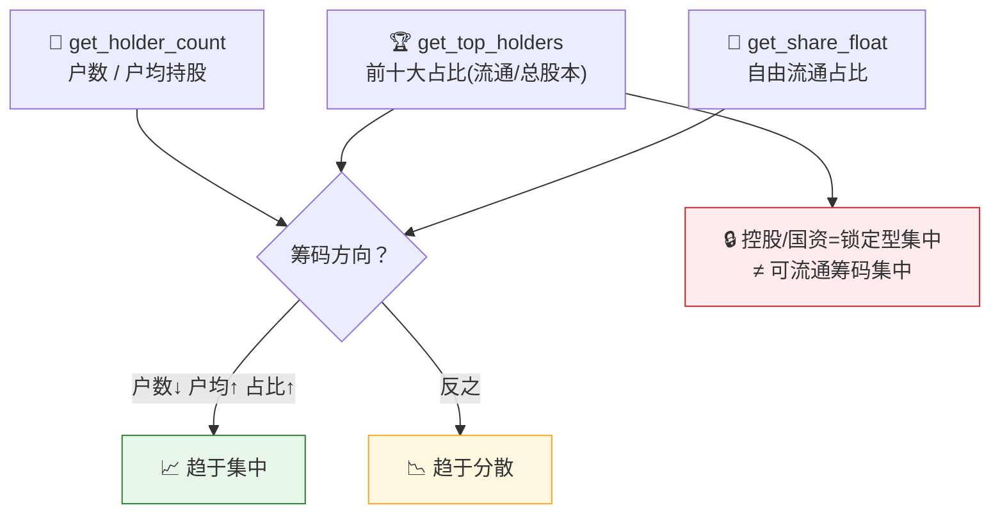

# 🧩 Holder Structure Scan Skill

**简体中文** | [English](README.en.md)

> 社区状态：Draft（社区草案） · 创建者/维护者：[`abgyjaguo`](https://github.com/abgyjaguo)

> A股**股东户数与筹码集中度扫描**：跟踪**股东户数趋势**与**户均持股**、**前十大股东合计占比**（流通/总股本口径不混用）、**自由流通占比**，判断多个披露期内筹码是在**集中**还是**分散** —— 单票或小自选清单，每个数据点标注来源接口、披露期与口径，明确披露频率与滞后。

<p align="center">
  
  
  
  
  
  
</p>

---

## 📖 这是什么

`holder-structure-scan` 是一个 **Agent Skill**：以**登记股东结构**为中心，回答"**这票筹码在集中还是分散、户数在增还是减、前十大攥得紧不紧、真正能流通的盘子有多小**"。

三个接口三个视角，**全是定期披露（多为季度）且滞后于期末**，不是日频：`get_holder_count`（户数/户均持股）→ 户数↓+户均↑ 通常=**集中**；`get_top_holders`（前十大占比，`flow` 流通口径 vs `total` 总股本口径，**不混用**）→ 合计占比及其环比；`get_share_float`（`free_circulation/total` 自由流通占比）→ 盘子越小，同样成交对价格越敏感。信号在**多期的变化方向**，不是单期快照；控股股东/国资的**锁定型集中**与可流通筹码的集中要分开说。

> 数据契约一律来自姊妹技能 [`pandadata-api`](https://github.com/quantskills/skill-pandadata-api)；本技能负责"查什么、怎么算集中度、怎么分口径、怎么读趋势"，不负责"接口长什么样"。

---

## 🧭 与同生态技能的边界（避免撞车）

| 技能 | 视角 | 何时用 |
|---|---|---|
| 🧩 **holder-structure-scan**（本技能） | **登记股东结构/筹码集中度**（多期趋势） | "这票筹码集中了吗""户数变化""前十大占比趋势""自由流通有多小" |
| 🔎 `stock-screener` | 全市场自然语言**选股过滤** | 想按股东条件筛全市场 → 移交它 |
| 🧠 `smart-money-profiler` | 龙虎榜/北向/两融**日频交易席位** | 想看每日盘面聪明钱 → 移交它（本技能读的是登记结构） |
| 🚨 `event-risk-alert` | 自选/持仓**风险事件**（解禁/质押/减持） | 想要事件级预警 → 移交它 |
| 🩺 `a-share-stock-dossier` | 单票全面尽调（股东只是一节） | 想看完整体检 → 移交它 |

---

## 🧬 股东结构模型（分析前必读）



- **户数趋势**：`holders` 环比 + `avg_holders` 方向，按 `end_date`（截止日）对齐。
- **前十大集中度**：Σ 前 N 名 `hold_percent_*`，**先选一个口径再标注**（流通 `flow` / 总股本 `total`），不混用。
- **自由流通占比**：`free_circulation / total`，标注分母；越小对价格越敏感。
- **方向读法**：户数↓ + 户均↑ + top-N占比↑ ⇒ 集中；反之分散；信号打架 ⇒ 稳定/混合（不硬下结论）。

---

## 🗂️ 报告章节 × 接口映射

| 章节 | 接口 | 回答什么 |
|---|---|---|
| 👥 **股东户数趋势** | `get_holder_count` | 户数增减、户均持股方向 |
| 🏆 **前十大集中度** | `get_top_holders` | 前 N 合计占比（标口径）及环比 |
| 🌊 **自由流通占比** | `get_share_float` | 真正能流通的盘子有多大 |
| 🧭 **筹码集中方向** | 三者合并 | 集中/分散/稳定 |
| 🔒 **大股东质押/冻结** | `get_top_holders`（`pledge`·`freeze`） | 前十大里的质押/冻结风险标记 |
| 🏭 **行业对照（可选）** | `get_stock_industry` | 自选清单的同业参照 |

---

## 🚀 快速开始

### 1️⃣ 安装（与 pandadata-api 一起）

```bash
# Claude Code（全局）
cp -r skill-pandadata-api         ~/.claude/skills/pandadata-api
cp -r skill-holder-structure-scan ~/.claude/skills/holder-structure-scan

# Codex（全局，Agent Skills 标准目录）
mkdir -p ~/.agents/skills
cp -r skill-pandadata-api         ~/.agents/skills/pandadata-api
cp -r skill-holder-structure-scan ~/.agents/skills/holder-structure-scan

# Cursor（项目级）
mkdir -p .cursor/skills
cp -r skill-pandadata-api         .cursor/skills/pandadata-api
cp -r skill-holder-structure-scan .cursor/skills/holder-structure-scan
```

### 2️⃣ 直接用自然语言提问

```text
000001.SZ 最近几期筹码在集中还是分散？给我户数趋势和前十大占比
帮我看看这只票的自由流通占比，盘子小不小
按流通口径对比这几只票的前十大集中度
600519.SH 户数环比降了多少？户均持股是不是在升
前十大股东里有没有高质押/冻结的
```

### 3️⃣ 报告结构（8 章）

```
摘要 → 股东户数趋势 → 前十大集中度 → 自由流通占比
→ 筹码集中方向 → 大股东质押/冻结 → 风险提示 → 数据说明
```

数据说明为表格：`数据模块 | 来源接口 | 查询窗口 | 披露期/截止日 | 口径(流通/总股本) | 返回行数 | 备注`。

---

## ⏰ 定时（可选）

围绕披露窗口运行（如每周，或季报披露截止后），而非每日 —— 这些数据按披露更新、非日频。任务幂等：`reports/holder-structure/<scope>-<date>.md` 已存在则覆盖重写。

---

## 📦 目录结构

```
holder-structure-scan/
├── SKILL.md                          # 技能入口：定位边界、股东结构模型、工作流、接口映射、分析模式、规则、自动化
├── references/
│   └── holder-structure-playbook.md  # 📒 路由表、三接口字段模型、集中度/趋势口径、口径规则、报告骨架、空数据处理、QA清单
├── scripts/
│   └── validate_report.py            # ✅ 校验报告章节/来源标注/口径标注/披露频率滞后/披露期/免责声明
└── agents/
    ├── cursor-rule.mdc               # Cursor 适配
    ├── openai.yaml                   # OpenAI/Codex 适配
    └── portable-loader.md            # Claude Code/Hermes/OpenClaw 适配
```

---

## 📐 核心约束

| 约束 | 说明 |
|---|---|
| 🧾 先查契约 | 所有调用先经 `pandadata-api` 核对三接口参数字段 |
| 🏷️ 口径必标 | 前十大占比区分流通口径(`hold_percent_float`)与总股本口径(`hold_percent_total`)，一次比较不混用 |
| 🗓️ 披露频率与滞后 | 户数/占比为定期披露且滞后期末，趋势需多期，单期快照≠实时持仓 |
| 🔒 锁定型 vs 可流通 | 控股/国资/限售的高占比是锁定型集中，非可流通筹码集中，须区分 |
| 🧮 多期看方向 | 户数↓+户均↑+占比↑ 才算集中；信号打架记"稳定/混合" |
| 🕳️ 空数据如实报 | 无披露保留标题写明"无数据 + 方法/窗口" |
| 🗣️ 措辞克制 | 用"筹码趋于集中/分散""自由流通占比偏低对成交更敏感"，不下涨跌结论，不用买卖语言 |

---

## ⚠️ 免责声明

本报告基于公开数据与规则化分析生成，仅供研究参考，不构成任何投资建议。

## 📜 License

This project is licensed under the GNU General Public License v3.0. See [LICENSE](LICENSE).

## 🐼 PandaAI / QUANTSKILLS 社群

<div align="center">
  
  <br>
  <sub>扫码加入 PandaAI 社群，交流 QUANTSKILLS 技能、Agent 工作流与量化研究实践。</sub>
</div>
