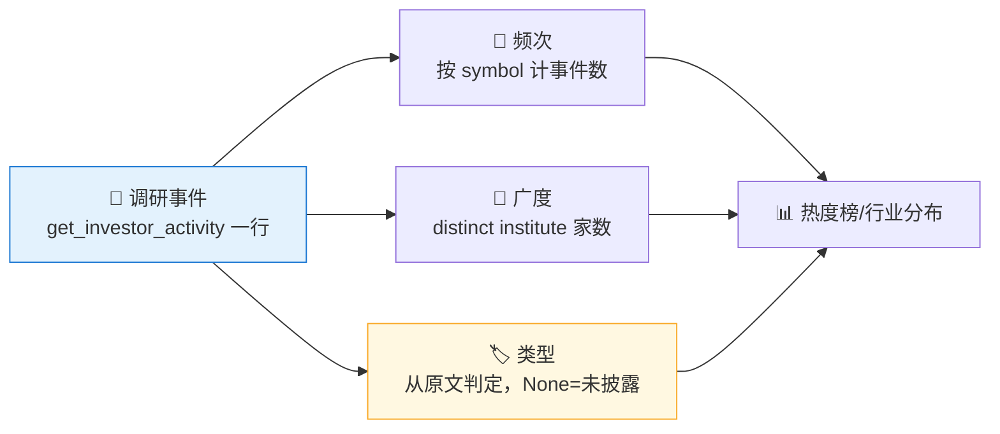

# 🔍 Institutional Research Tracker Skill

**简体中文** | [English](README.en.md)

> 社区状态：Draft（社区草案） · 创建者/维护者：[`abgyjaguo`](https://github.com/abgyjaguo)

> A股**机构调研热度监控**：基于 `get_investor_activity` 统计**被调研次数**、**参与机构广度**、**机构类型分布**（从文本判定）、**行业调研分布**，并支持**单票调研时间线** —— 全市场扫描或单票，每个数据点标注来源接口与活动日期。

<p align="center">
  
  
  
  
  
  
</p>

---

## 📖 这是什么

`institutional-research-tracker` 是一个 **Agent Skill**：以**机构调研活动**为中心扫描 A 股 `get_investor_activity`，回答"**最近哪些公司被调研得最多、多少家机构参与、都是什么类型的机构、哪些行业被集中调研**"。

`get_investor_activity` **一次调研事件一行**，且字段常常稀疏（示例里 `participant`、`institute` 为 None），本技能把 None 记为**未披露**、绝不编造名字；把**被调研次数（频次）**与**参与机构家数（广度）**当作两个不同指标分别列示；机构类型只从 `institute`／`investor_or_analyst_detail` 的**原文信号**判定。

> **被调研 = 关注度，不是买入信号，也不是背书。** 数据契约一律来自姊妹技能 [`pandadata-api`](https://github.com/quantskills/skill-pandadata-api)。

---

## 🧭 与同生态技能的边界（避免撞车）

| 技能 | 视角 | 何时用 |
|---|---|---|
| 🔍 **institutional-research-tracker**（本技能） | **机构关注度/调研热度**（谁去调研了） | "调研热度榜""哪些公司被机构密集调研""某票被谁调研了" |
| 🧠 `smart-money-profiler` | 龙虎榜席位身份、北向行为、资金合力（真正**成交**的钱） | 想看谁在**买卖** → 移交它（被调研≠被买入） |
| 📅 `earnings-season-tracker` / 📈 `market-daily-review` | 财报季 / 每日全市场 | 不同事件族，调研热门股可与其**互相印证** |
| 🩺 `a-share-stock-dossier` | 单票深度尽调 | 想看某公司完整体检 → 移交它 |

---

## 🧬 调研活动模型（分析前必读）



- **频次 ≠ 广度**：被调研 12 次 与 12 家机构参与是两个指标，分别列示。
- **机构类型**：只从 `institute`／`investor_or_analyst_detail` 原文判定（公募/券商/保险/私募/外资），不匹配或 None → 未披露。
- **字段稀疏**：如实报出未披露比例，广度仅在已披露子集上计算，绝不臆造。

---

## 🗂️ 报告章节 × 接口映射

| 章节 | 接口 | 回答什么 |
|---|---|---|
| 📋 **调研活动总览** | `get_investor_activity` | 窗口内调研事件数、被调研公司数 |
| 🔥 **调研热度榜** | `get_investor_activity`（按 `symbol` 计数） | 哪些公司被调研最多（频次） |
| 🏢 **机构参与广度** | `get_investor_activity`（distinct `institute`） | 哪些公司吸引最多**家**机构 |
| 🏷️ **机构类型分布** | `get_investor_activity`（`institute`·`detail`） | 公募/券商/保险/私募/外资 占比 |
| 🏭 **行业调研分布** | `get_stock_industry` + 上述 | 哪些行业被集中调研 |
| 📈 **单票调研时间线** | `get_investor_activity`（单 `symbol`） | 某公司调研节奏与参与机构 |

---

## 🚀 快速开始

### 1️⃣ 安装（与 pandadata-api 一起）

```bash
# Claude Code（全局）
cp -r skill-pandadata-api                   ~/.claude/skills/pandadata-api
cp -r skill-institutional-research-tracker  ~/.claude/skills/institutional-research-tracker

# Codex（全局，Agent Skills 标准目录）
mkdir -p ~/.agents/skills
cp -r skill-pandadata-api                   ~/.agents/skills/pandadata-api
cp -r skill-institutional-research-tracker  ~/.agents/skills/institutional-research-tracker

# Cursor（项目级）
mkdir -p .cursor/skills
cp -r skill-pandadata-api                   .cursor/skills/pandadata-api
cp -r skill-institutional-research-tracker  .cursor/skills/institutional-research-tracker
```

### 2️⃣ 直接用自然语言提问

```text
扫一遍最近 30 天全市场的机构调研，给我热度榜和机构类型分布
最近哪些公司被机构密集调研？区分调研次数和参与机构家数
000001.SZ 最近被谁调研了？给我一条调研时间线
哪些行业最近调研最集中？
设置一个每交易日盘后自动跑的调研热度监控任务
```

### 3️⃣ 报告结构（8 章）

```
摘要 → 调研活动总览 → 调研热度榜 → 机构参与广度
→ 机构类型分布 → 行业调研分布 → 风险提示 → 数据说明
```

数据说明为表格：`数据模块 | 来源接口 | 查询窗口 | 返回行数(去重前/后) | 快照日/活动区间 | 字段缺失说明 | 备注`。

---

## ⏰ 定时（可选）

在交易日盘后（建议 `18:00 Asia/Shanghai` 之后）运行，捕捉当日投资者关系活动公告。任务幂等：`reports/research/<scope>-<date>.md` 已存在则覆盖重写；非交易日跳过。

---

## 📦 目录结构

```
institutional-research-tracker/
├── SKILL.md                        # 技能入口：定位边界、活动模型、类型判定、工作流、接口映射、规则、自动化
├── references/
│   └── research-playbook.md        # 📒 路由表、频次/广度/类型口径、报告骨架、空数据与字段稀疏处理、QA清单
├── scripts/
│   └── validate_report.py          # ✅ 校验报告章节/来源标注/频次广度区分/类型分布/关注非背书/免责声明
└── agents/
    ├── cursor-rule.mdc             # Cursor 适配
    ├── openai.yaml                 # OpenAI/Codex 适配
    └── portable-loader.md          # Claude Code/Hermes/OpenClaw 适配
```

---

## 📐 核心约束

| 约束 | 说明 |
|---|---|
| 🧾 先查契约 | 所有调用先经 `pandadata-api` 核对 `get_investor_activity` 参数字段 |
| 🔢 频次广度分列 | 被调研次数与参与机构家数是两个指标，必须分别列示 |
| 🏷️ 类型按源判定 | 机构类型只从原文信号判定，不匹配或 None → 未披露 |
| 🕳️ 字段稀疏如实报 | None 记未披露并报出比例，广度只在已披露子集上算，绝不臆造名字 |
| 🚫 关注非背书 | 被调研是关注度，不是买入信号或背书，措辞克制 |
| 📸 快照属性 | 调研活动持续累积，扫描是某时点快照，须标注快照日/活动区间 |
| 📈 价格叠加仅描述 | 如做价格叠加仅作描述，不主张因果 |
| 🗣️ 措辞克制 | 用"机构关注度较高""参与机构较广""调研密集"，不下涨跌结论 |

---

## ⚠️ 免责声明

本报告基于公开数据与规则化分析生成，仅供研究参考，不构成任何投资建议。

## 📜 License

This project is licensed under the GNU General Public License v3.0. See [LICENSE](LICENSE).

## 🐼 PandaAI / QUANTSKILLS 社群

<div align="center">
  
  <br>
  <sub>扫码加入 PandaAI 社群，交流 QUANTSKILLS 技能、Agent 工作流与量化研究实践。</sub>
</div>
