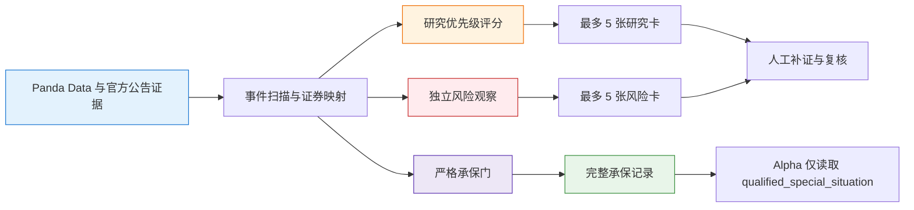

# 克拉曼特殊情况投资 Skill

**简体中文** | [English](README.en.md)

> 基于 Seth Klarman 特殊情况投资框架的 A 股事件驱动研究 Skill。它将定增解禁、重组借壳、分拆上市和困境反转转化为可复核的研究任务：识别催化剂，核验基本面和公告证据，区分潜在价值与供给或失败风险，并明确下一步需要补齐的关键事实。

**创建者 / 维护者**：[`dijia702`](https://github.com/dijia702)<br>
**项目状态**：QuantSkills 社区项目；未经社区审核，不代表官方、认证、验证或背书。

<p align="center">
  
  
  
  
  
  
</p>

---

## 这是什么

`skill-klarman-special-situations` 是面向研究员、投研 agent 和 Alpha 工作流的特殊情况投资研究 Skill，包含两层相互隔离的能力：

1. **事件研究与优先级排序**：扫描四类 A 股特殊情况，输出最多 5 条研究候选和最多 5 条独立风险观察，帮助研究者分配下一步的公告、条款和财务核验工作。
2. **失败封闭的严格承保**：逐项核验证券映射、催化剂、交易条款、保守价值、失败价值、资本结构、法律审计、流动性和安全边际。核心证据缺失时保持不完整，不把事件自动升级为机会。

它不把定增折价、风险警示撤销或重组批文等单一事件直接视为投资机会。研究候选、风险观察和承保状态均不是买卖建议；只有原始事件行的 `qualified_special_situation` 才允许后续 Alpha 在自身风险与合规约束下读取。

> 数据和字段口径以 [Panda Data 接口与承保口径](开发产物/references/api_guide.md) 为准。真实调用先核对接口契约与可用字段，不猜测接口签名。

---

## 研究流水线



实时研究榜只使用决策日当日或之前最新公开的证据；历史回放只使用事件当时可见的证据。两个时间口径分别保存，禁止混用。

---

## 四类特殊情况

| 事件 | 研究问题 | Panda Data 主要接口 | 输出边界 |
|---|---|---|---|
| 定增解禁 | 解禁是否会形成供给冲击，市场流动性能否消化 | `get_stock_private_placement`、`get_restricted_list`、`get_share_float`、`get_stock_daily` | 只进入独立风险观察。参与者发行价与浮盈不是二级市场买方的安全边际。 |
| 重组 / 借壳 | 是否存在可验证的监管催化剂、证券映射和交易条件，失败后价值如何 | `get_stock_csrc_approval`；`get_stock_material_contract` 仅作背景 | 重组失败压力不低于 30%，必须补交易条款、失败价值、资本结构和法律审计。 |
| 分拆上市 | 母公司持股、子公司价值、剩余业务、债务、税费与控股折价能否支持 SOTP | `get_stock_csrc_approval`、`get_stock_detail` | 重大合同金额不能替代子公司价值。缺证券映射或估值证据时不得晋级。 |
| 困境反转 | 风险警示、财务、审计和清偿顺位是否发生实质改善 | `get_stock_status_change`、`get_fina_reports`、`get_audit_opinion` | 摘帽、利润转正或无保留意见只是研究入口，不能替代债务、担保和股权回收分析。 |

---

## 研究候选与风险观察

### 研究候选

研究候选回答的是“下一步优先研究什么”，不是“应该买什么”。总榜最多 5 只，每类最多 3 只，低于 60 分或缺证券代码、当前可交易价格、有效事件日期的记录不凑数进入榜单。排序规则固定为分数降序、事件日期降序、证券代码升序、事件 ID 升序。

| 类别 | 透明评分构成 | 最低展示条件 |
|---|---|---|
| 困境反转 | 状态事件 30 分 + 财务改善 30 分 + 审计质量 20 分 + 市场与时效 15 分 + 资本行为背景 5 分 | 证券映射、事件日、当前价格完整，总分不少于 60 分 |
| 重组 / 分拆 | 催化剂 30 分 + 当前财务 25 分 + 当前审计 20 分 + 市场与时效 15 分 + 上下文 10 分 | 同上；卡片固定提示失败压力和待补证据 |

每张研究卡均带排名、证券、事件、分数拆解、研究理由、风险、待补证据、下一步动作、当前市场证据、承保状态和 `not_trade_signal=true`。

### 独立风险观察

风险观察与机会榜严格分离，最多输出 5 条。定增解禁风险卡会呈现：

- 解禁量占流通 A 股比例；
- 定增参与者相对当前市场价格的浮盈；
- 距解禁日天数；
- 解禁市值相对 20 日平均成交额的估算消化天数。

仍处于风险警示、存在审计警示、财务核验失败、经营现金流为负或有股东减持背景的困境事件，也可进入风险清单。

---

## 严格承保

核心原则是：事件只提供研究入口，安全边际必须来自可验证的保守价值与失败价值。

```text
安全边际 = 1 - 市场价格 / 保守价值
```

承保门不以总分抵消缺失项。可交易证券、催化剂、交易条款、保守价值、失败价值、资本结构、法律审计、流动性和安全边际逐项标记为 `pass`、`missing` 或 `fail`；任一核心门缺失或失败，记录就不能成为 `qualified_special_situation`。

| 状态 | 含义 | 可作为 Alpha 输入 |
|---|---|---|
| `risk_watch` | 供给或困境风险观察 | 否 |
| `underwriting_incomplete` | 事件真实，但核心承保证据未补齐 | 否 |
| `qualified_special_situation` | 所有核心门和冻结 policy 均通过 | 是 |
| `rejected` | 已有证据表明核心门失败 | 否 |
| `insufficient_evidence` | 证券身份或必需接口不可用 | 否 |
| `no_events` | 扫描成功但未发现可观察事件 | 否 |

本 Skill 只覆盖 A 股多头现货研究，不假设融券、对冲腿或衍生品；不输出买卖方向、具体仓位、胜率或收益承诺。

---

## 接口映射

| 需求 | 主要接口 | 说明 |
|---|---|---|
| 定增发行与解禁 | `get_stock_private_placement`、`get_restricted_list`、`get_share_float` | 识别解禁供给压力与流通盘比例 |
| 监管催化剂 | `get_stock_csrc_approval` | 提供批文、公告和官方链接，不替代完整交易条款 |
| 合同背景 | `get_stock_material_contract` | 只作证券和关键词弱关联，不能提升承保状态 |
| 困境事件与基本面 | `get_stock_status_change`、`get_fina_reports`、`get_audit_opinion` | 核验状态变化、财务改善和审计质量 |
| 市场与流动性 | `get_stock_daily` | 提供点时价格、停复牌、成交量、成交额和 20 日平均成交额 |
| 补充风险 | `get_stock_pledge`、`get_stock_litigation_arbitration`、`get_cumu_guarantee`、`get_stock_equity_illegal` | 记录质押、诉讼、担保和违规等风险 |
| 资本行为背景 | `get_repurchase`、`get_stock_equity_placard`、`get_stock_shareholder_change` | 只用于有限背景解释与加减分 |

完整的入参、字段、点时证据要求、接口失败语义和生产契约见 [api_guide.md](开发产物/references/api_guide.md)。

---

## `get_restricted_list` 套餐配额降级策略

`get_restricted_list` 用于识别定增解禁日期、解禁数量和供给压力。部分 Panda Data 套餐可能偶发返回配额或限流错误；这不是“没有解禁事件”，也不能用空结果替代真实数据。

| 阶段 | 系统行为 | 使用者应如何解读 |
|---|---|---|
| 识别与重试 | 命中“限额 / 套餐 / quota / rate limit”后标记 `quota_or_rate_limit`，按 `max_api_attempts` 有界退避重试；可设 1–4 次，默认 2 次 | 不无限重试，也不隐瞒失败原因 |
| 重试耗尽 | `source.capabilities.get_restricted_list.status=unavailable`，并写入 `result_type=coverage_gap`、`result_value=insufficient_evidence` 的记录，含 `failure_class` 与 `attempts` | 本次定增解禁覆盖不完整，不能把空结果理解为“无解禁” |
| 研究与风险输出 | 本次不会根据缺失的解禁表生成或刷新 `private_placement_supply_risk` 风险卡；`research_digest` 标记为 `coverage_status=partial` | 风险榜中没有定增解禁卡，不代表没有供给压力 |
| 生产健康 | P4 健康报告的 `coverage_gaps` 会列出 `get_restricted_list`，并给出 `coverage_gap` 告警 | 即使 Parquet 版本与结构有效，也要同时检查覆盖缺口，不能只看 `--check-production` 的文件状态 |
| 恢复 | 等待套餐配额恢复或完成权限调整后重跑完整扫描；同一决策日的补跑必须重新使用该日可见数据 | 不切换未批准的第三方数据源，不把旧快照混入当前快照，也不手工填“零解禁” |

其他三类事件仍可按各自接口继续扫描，但整次快照必须明确为部分覆盖。旧的完整快照只可作为带日期的历史审计材料，不能伪装成当前定增解禁结论。

---

## 快速开始

### 1. 安装开发版 Skill

开发版用于触发扫描、研究和验证。将 `开发产物` 安装为目标 Agent 的 skill 目录，并保持目录内的 `SKILL.md`、`scripts/` 和 `references/` 完整：

```powershell
# Codex / 通用 Agent Skills 目录
New-Item -ItemType Directory -Force "$env:USERPROFILE\.agents\skills" | Out-Null
Copy-Item -Recurse -Force .\开发产物 "$env:USERPROFILE\.agents\skills\skill-klarman-special-situations"

# Claude Code 示例
New-Item -ItemType Directory -Force "$env:USERPROFILE\.claude\skills" | Out-Null
Copy-Item -Recurse -Force .\开发产物 "$env:USERPROFILE\.claude\skills\skill-klarman-special-situations"
```

生产查询场景应读取 [生产版 Skill](生产产物/SKILL.md) 与已有 `生产产物/数据库.parquet`，不要因多人查询重复触发全市场扫描。

### 2. 直接提出研究请求

```text
扫描最近一年 A 股特殊情况，给出优先研究的候选和独立风险观察。
解释今天风险观察中的定增解禁压力，列出需要核验的供给和流动性证据。
对某只股票的重组事件做克拉曼式承保：先列待补事实，不要给交易建议。
梳理风险警示撤销后的困境反转证据，并说明它为什么尚未构成完整承保。
```

### 3. 本地调用与验收

Panda Data 凭据只能在本地进程环境中使用，不能写入代码、文档、日志或仓库。

```powershell
$env:PANDA_DATA_USERNAME = "<Panda Data 账号>"
$env:PANDA_DATA_PASSWORD = "<Panda Data 密码>"

# 全市场扫描并落地生产快照
python 开发产物\scripts\build.py --as-of 20260724 --start 20250724 --materialize --evidence-dir "<官方公告证据目录>" --progress

# 检查现有生产结果，不发起扫描
python 开发产物\scripts\build.py --check-production
python 开发产物\scripts\validate_build.py
```

### 4. 查看结果与演示

- [生产看板](validation/production_dashboard.html) 只读生产 Parquet 和运行报告，不会触发 Panda Data 查询。
- [演示讲解页](validation/skill_demo.html) 展示研究候选、风险观察、评分贡献和承保边界。
- [录制讲稿](validation/录制讲稿.md) 提供约 3 分钟的演示顺序。
- [演示视频](开发产物/demo.mp4) 为交付包中的运行演示。

```powershell
python 开发产物\scripts\demo_html.py --no-screenshot
start validation\skill_demo.html
```

---

## 输出结构

开发版标准入口为 `run(input_data, config=None)`。其返回 `research_digest`、原始事件记录、接口能力状态、覆盖统计和可选的生产路径：

```python
from scripts.build import run

result = run(
    {"as_of_date": "20260724", "start_date": "20250724"},
    config={"evidence_dir": r"<官方公告证据目录>", "materialize": False},
)

shortlist = result["research_digest"]["shortlist"]
risks = result["research_digest"]["risk_watchlist"]
```

| 输出 | 含义 |
|---|---|
| `research_digest.shortlist` | 最多 5 条研究候选，固定 `not_trade_signal=true` |
| `research_digest.risk_watchlist` | 最多 5 条独立风险观察，固定 `not_trade_signal=true` |
| `excluded_summary` | 未入榜的原因统计，例如缺价格、低于阈值或类别上限 |
| `unmapped_event_count` | 缺证券映射的监管事件数量，进入待映射统计 |
| `records` | 原始事件、覆盖缺口、扫描摘要和 `research_digest` 聚合记录 |
| `production_path` | 仅在 `materialize=true` 时返回的生产 Parquet 路径 |

生产库保留 `schema_version=2.0.0` 的 14 列外层结构。`research_digest` 以 `target_id=research_digest`、`result_type=research_digest` 的聚合记录写入，不能覆盖原始事件承保状态。

---

## 目录结构

```text
skill-klarman-special-situations/
├── SKILL.md                          # 根级 Skill 声明、工作流与跨运行时约束
├── README.md                         # 中文项目说明、使用方式与研究边界
├── README.en.md                      # English documentation
├── LICENSE                           # GNU GPL v3.0（GPL-3.0-only）
├── skill.json                        # 版本、入口、许可证与上游元数据
├── skill.yml                         # QuantSkills 社区与跨运行时元数据
├── agents/
│   ├── openai.yaml                   # OpenAI / Codex 界面入口
│   ├── cursor-rule.mdc               # Cursor 规则入口
│   └── portable-loader.md            # Hermes / OpenClaw 通用加载入口
├── scripts/                           # 根级可运行入口、扫描、承保与验证脚本
├── references/                        # Panda Data 接口契约与事件证据模板
├── 开发产物/
│   ├── SKILL.md                       # 开发版 Skill：工作流、输入输出与约束
│   ├── skill.json                     # 版本、入口、数据源与生产输出
│   ├── scripts/                       # 扫描、承保、验证、看板与测试
│   ├── references/                    # API 契约与四类事件证据模板
│   └── demo.mp4                       # 运行演示
├── 生产产物/
│   ├── SKILL.md                       # 生产结果读取规则
│   └── 数据库.parquet                 # 已生成的全 A 股生产结果
├── validation/
│   ├── production_dashboard.html      # 生产只读看板
│   ├── skill_demo.html                # 演示讲解页
│   ├── 录制讲稿.md                     # 视频讲解稿
│   └── operations/                    # 健康报告、运行清单、证据队列和点时账本
├── CONTRIBUTING.md                    # 协作与提交规则
├── SECURITY.md                        # 凭据和敏感数据处置规则
└── 发布说明.md                         # 版本交付与接口降级说明
```

---

## 核心约束

| 约束 | 说明 |
|---|---|
| 先查接口契约 | 真实调用前核对 Panda Data 方法、参数和字段，不猜签名 |
| 事实与研究解读分开 | 事件、价格、财务和公告为事实；评分与研究动作是可复核的规则化解读 |
| 失败封闭 | 核心承保证据缺失或失败时，保持不完整，不以评分掩盖缺失 |
| 定增不当套利 | 定增折价和参与者浮盈只用于供给风险分析，不转为二级市场机会 |
| 时间口径锁定 | 实时研究与历史回放使用不同的点时证据口径，禁止混用 |
| 套餐配额降级 | `get_restricted_list` 配额耗尽时输出 `quota_or_rate_limit` 与 `coverage_gap`；不把缺失解读为无解禁，不用旧数据伪装为当前覆盖 |
| Alpha 消费边界 | 只有 `qualified_special_situation` 原始事件行可被 Alpha 读取 |
| 生产结果只读 | 多人查询读取 Parquet；不手工修改、不重复触发重计算 |
| 凭据不落盘 | 不提交 Panda Data 用户名、密码、令牌、环境文件或原始服务端错误内容 |

---

## 接口与事件解释

| 概念 | 含义 | 正确使用方式 |
|---|---|---|
| 定增解禁 | 过去参与定向增发的股份到期可流通，可能增加市场卖方供给 | 用解禁比例、参与者浮盈和成交额消化天数观察风险；不把发行价当成普通投资者成本 |
| 重组 / 借壳 | 公司通过资产重组、发行股份购买资产或控制权安排改变资产与业务结构 | 批文和公告只确认催化剂；继续核交易条款、失败价值、资本结构与法律风险 |
| 分拆上市 | 母公司将子公司拆出独立上市，母公司可能持有未被充分识别的权益 | 做母公司 SOTP，核对持股比例、子公司价值、剩余业务、净债务、税费和控股折价 |
| 困境反转 | 经营或财务困境企业出现风险警示、利润或审计质量改善 | 将其作为研究入口，再核资产回收、担保顺位、优先债务和完全稀释后的股权回收 |

---

## 跨运行时入口

| 运行时 | 入口与安装方式 |
|---|---|
| Codex / Claude Code | 直接加载仓库根目录 `SKILL.md`，调用名为 `$klarman-special-situations` |
| Cursor | 将仓库放入 `.cursor/skills/klarman-special-situations`，使用 `agents/cursor-rule.mdc` |
| Hermes / OpenClaw | 优先加载完整 Skill 目录；不支持原生发现时使用 `agents/portable-loader.md` |
| OpenAI / Codex 界面 | 使用 `agents/openai.yaml` 提供展示名称、简介和默认提示词 |

## 许可证

本项目采用 GNU General Public License v3.0，SPDX 标识为 `GPL-3.0-only`。完整条款见 [LICENSE](LICENSE)。

## 免责声明

本 Skill 基于公开数据、官方公告证据和规则化分析生成，所有输出仅供研究、复核和系统集成使用，不构成任何投资建议。特殊情况事件的失败率、流动性和信息不确定性均可能很高，调用方必须独立处理估值、组合、风险和合规约束。
