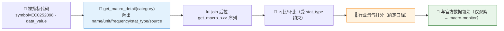

# 📡 Macro Alt-Data Nowcast Skill

**简体中文** | [English](README.en.md)

> 宏观**特色（另类）高频数据行业景气 Nowcasting**：先用 `get_macro_detail` 把不透明指标代码解成**名称/单位/频率/来源**，再拉**电商·医药·能化·汽车·家电·商超·招聘·地产·电子·电新**十类特色序列，算**同比/环比**与趋势、读**与官方数据的领先**，输出单行业 nowcast 或跨行业景气仪表盘 —— 每个数值标注指标代码、来源接口与数据期，另类=及时样本、非官方统计。

> 项目状态：QUANTSKILLS 社区项目（Draft）；创建者与维护者：[abgyjaguo](https://github.com/abgyjaguo)。

<p align="center">
  
  
  
  
  
  
</p>

---

## 📖 这是什么

`macro-altdata-nowcast` 是一个 **Agent Skill**：读 Pandadata **宏观特色数据**（另类、高频）序列，回答"**哪个行业在回暖、哪个在走弱、这些高频信号有没有领先官方读数**"。

特色序列的返回**极简且不透明**——只有 `symbol`（指标代码，如 `EC0252098`）、`period_date`、`data_value`。**一个裸代码毫无意义**，所以工作流的第一步永远是：**先 `get_macro_detail(category=...)`** 把每个代码解成 `name/unit/frequency/stat_type/info_source/覆盖区间`，再拉对应 `get_macro_<x>`。`stat_type` 决定能不能求同比（**已经是同比的序列不再二次求同比**）。另类数据是**及时的样本**（某平台电商 GMV、某招聘站职位数），用于 **nowcast** 方向与拐点，**不是官方统计**，带样本/覆盖偏差。

> 数据契约一律来自姊妹技能 [`pandadata-api`](https://github.com/quantskills/skill-pandadata-api)；本技能负责"查哪些代码、怎么解字典、怎么算同比环比、怎么打景气分、怎么看领先"，不负责"接口长什么样"。

---

## 🧭 与同生态技能的边界（避免撞车）

| 技能 | 视角 | 何时用 |
|---|---|---|
| 📡 **macro-altdata-nowcast**（本技能） | 宏观**特色（另类）高频**行业景气 nowcast | "电商/招聘/地产高频怎么样""哪个行业景气回升""另类数据领先官方吗" |
| 🌐 `macro-monitor` | **官方**宏观指标（GDP/CPI/PPI/PMI/社融/M2 + 标准宏观行业） | 想看官方宏观/行业数据 → 移交它（本技能只做特色另类数据） |
| 🌡️ `index-valuation-rotation` | 指数 PE/PB 分位 + 行业**价格**动量 | 想看估值/价格轮动 → 移交它（景气≠价格） |
| 🏭 `futures-industrial-profit` | 期货**现货报价/产业利润** | 想看商品产业链 → 移交它 |

---

## 🧬 另类数据模型（分析前必读）



- **先解字典**：任何代码/数值都要先经 `get_macro_detail` 解出名称、单位、频率，绝不裸报代码。
- **尊重 stat_type**：已是同比/累计的序列不再二次求同比，按发布口径读。
- **另类=样本**：及时但有覆盖偏差，nowcast 方向拐点，非官方统计，须每次说明。
- **频率各异**：日/周/月频从 `frequency` 读，末端 1–2 期为暂定值。

---

## 🗂️ 十类特色数据 × 接口

| 类别 | 接口 | 行业 |
|---|---|---|
| EC | `get_macro_ec` | 线上电商 |
| MD | `get_macro_md` | 医药 |
| EH | `get_macro_eh` | 能化 |
| AD | `get_macro_ad` | 汽车 |
| HA | `get_macro_ha` | 家电 |
| OF | `get_macro_of` | 线下商超 |
| RB | `get_macro_rb` | 招聘 |
| RE | `get_macro_re` | 房地产 |
| ED | `get_macro_ed` | 电子 |
| EP | `get_macro_ep` | 电新 |
| — | `get_macro_detail` | 指标字典（**先调**） |

---

## 🚀 快速开始

### 1️⃣ 安装（与 pandadata-api 一起）

```bash
# Claude Code（全局）
cp -r skill-pandadata-api          ~/.claude/skills/pandadata-api
cp -r skill-macro-altdata-nowcast  ~/.claude/skills/macro-altdata-nowcast

# Codex（全局，Agent Skills 标准目录）
mkdir -p ~/.agents/skills
cp -r skill-pandadata-api          ~/.agents/skills/pandadata-api
cp -r skill-macro-altdata-nowcast  ~/.agents/skills/macro-altdata-nowcast

# Cursor（项目级）
mkdir -p .cursor/skills
cp -r skill-pandadata-api          .cursor/skills/pandadata-api
cp -r skill-macro-altdata-nowcast  .cursor/skills/macro-altdata-nowcast

# Hermes（全局）
mkdir -p ~/.hermes/skills
cp -r skill-pandadata-api          ~/.hermes/skills/pandadata-api
cp -r skill-macro-altdata-nowcast  ~/.hermes/skills/macro-altdata-nowcast

# OpenClaw（全局）
mkdir -p ~/.openclaw/skills
cp -r skill-pandadata-api          ~/.openclaw/skills/pandadata-api
cp -r skill-macro-altdata-nowcast  ~/.openclaw/skills/macro-altdata-nowcast
```

### 2️⃣ 直接用自然语言提问

```text
最近地产高频数据怎么样？给我关键指标的同比环比和趋势
把电商、招聘、汽车三个行业的特色数据做一份跨行业景气对比
招聘数据有没有领先官方就业读数？帮我并排看看
电新（EP）特色数据里哪些指标在回升？先把指标代码解出来
设置一个每周跑一次的另类高频行业景气 nowcast 任务
```

### 3️⃣ 报告结构（7 章）

```
摘要 → 指标字典 → 行业景气快照 → 趋势与拐点
→ 跨行业对比 → 与官方数据的领先 → 数据说明
```

数据说明为表格：`数据模块 | 类别 | 来源接口 | 指标代码→名称 | 频率 | stat_type | 查询窗口 | 数据期 | 来源 | 备注`。

---

## ⏰ 定时（可选）

按序列频率选节奏（周频序列建议每周）运行。任务幂等：`reports/altdata/<scope>-<date>.md` 已存在则覆盖重写。定期重解 `get_macro_detail`，指标代码与覆盖会变。

---

## 📦 目录结构

```
macro-altdata-nowcast/
├── SKILL.md                        # 技能入口：定位边界、另类数据模型、工作流、接口映射、分析模式、规则、自动化
├── references/
│   └── altdata-playbook.md         # 📒 类别→接口映射、强制解码步骤、同比环比与stat_type、景气打分约定、报告骨架、空数据处理、QA清单
├── scripts/
│   └── validate_report.py          # ✅ 校验报告章节/来源标注/指标字典/另类样本口径/频率窗口/免责声明
└── agents/
    ├── cursor-rule.mdc             # Cursor 适配
    ├── openai.yaml                 # OpenAI/Codex 适配
    └── portable-loader.md          # Claude Code/Hermes/OpenClaw 适配
```

---

## 📐 核心约束

| 约束 | 说明 |
|---|---|
| 🧾 先查契约 | 所有调用先经 `pandadata-api` 核对 `get_macro_detail` / `get_macro_*` 参数字段 |
| 📖 先解字典 | 先 `get_macro_detail(category)` 把不透明代码解成名称/单位/频率，绝不裸报代码或裸数值 |
| 📐 尊重口径 | 受 `stat_type` 约束：已为同比/累计的序列不再二次求同比 |
| 📡 另类=样本 | 特色数据是及时样本，nowcast 方向拐点，非官方统计，须每次注明来源/覆盖 |
| 🗓️ 频率与暂定 | 标注日/周/月频与窗口，末端 1–2 期为暂定值 |
| 🔭 领先仅观察 | 与官方数据的领先仅作相对观察，官方序列移交 `macro-monitor` |
| 🕳️ 空数据如实报 | 无字典/无数据保留标题写明"无数据 + 方法/类别/窗口" |
| 🗣️ 措辞克制 | 用"景气回升/走弱""或领先官方读数"，不下涨跌结论，不给买卖指令 |

---

## ⚠️ 免责声明

本报告基于公开数据与规则化分析生成，仅供研究参考，不构成任何投资建议。

## 📜 License

This project is licensed under the GNU General Public License v3.0. See [LICENSE](LICENSE).

## 🐼 PandaAI / QUANTSKILLS 社群

<div align="center">
  
  <br>
  <sub>扫码加入 PandaAI 社群，交流 QUANTSKILLS 技能、Agent 工作流与量化研究实践。</sub>
</div>
