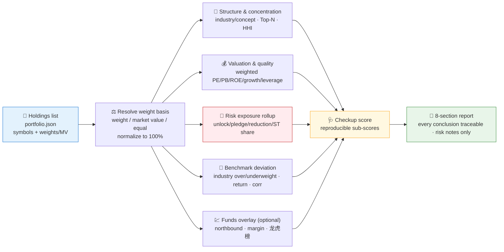
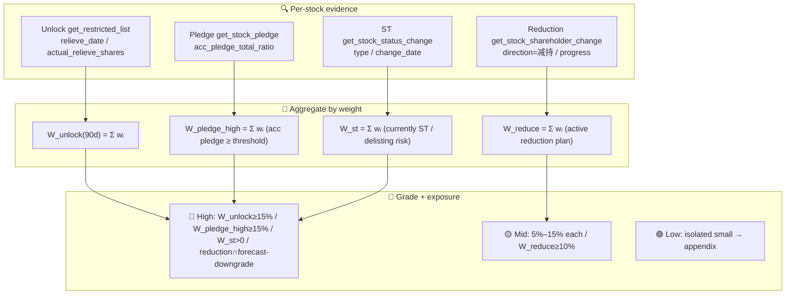

# 🩺 Portfolio Checkup Skill

[简体中文](README.md) | **English**

> Give it a holdings list (symbols + weights/market value), get back a **portfolio-level** health report: structure & concentration, weighted valuation & financial-quality distribution, risk-exposure aggregation (unlock/pledge/reduction/ST), and benchmark deviation plus a funds overlay. Not one stock at a time — how concentrated your **whole book** is, how much of it sits in risk, and where it deviates from the benchmark.

<p align="center">
  
  
  
  
  
  
  
</p>

---

## 📖 What is this

`portfolio-checkup` is an **Agent Skill**: a **portfolio-level** health check on your holdings list (ideally maintained as a local `portfolio.json`). It chains 15+ scattered Pandadata interfaces into a pipeline of **5 checkup modules**, first pulling each constituent's facts and then aggregating them with a single, stated **weight basis** into portfolio metrics — producing an 8-section structured report where every conclusion is annotated with its source interface, reporting period / data date, and query window.

Its most distinctive capability is **aggregating single-stock risk into portfolio exposure percentages**: not per-stock alerts ("which stock unlocks next"), but "**what share** of my book (by weight) is exposed to unlocks / high pledge / reduction plans / ST over the next 90 days".

> This is the **orchestration / portfolio layer** of the Pandadata skill family. All data contracts come from the sibling skill [`pandadata-api`](https://github.com/quantskills/skill-pandadata-api); this skill decides *what to query, how to aggregate, and how to judge*, not *what the interfaces look like*.

---

## 🧭 Where it sits in the family (anti-collision)

It lifts three single-point skills to the portfolio layer, with clear division of labor:

| Sibling skill | Its altitude | This skill's difference |
|---|---|---|
| 🔬 [`a-share-stock-dossier`](https://github.com/quantskills/skill-a-share-stock-dossier) | One symbol, deep | **Weighted aggregation across the list.** When a constituent needs a deep dive, **hand it to dossier**; this skill stays at the weighted-aggregate altitude. |
| 🚨 [`event-risk-alert`](https://github.com/quantskills/skill-event-risk-alert) | Per-symbol, time-triggered alerts | **Portfolio exposure rollup.** Answers "how much of the book is exposed to unlock/pledge/reduction/ST", not "which stock fires which alert today". |
| 📊 [`index-valuation-rotation`](https://github.com/quantskills/skill-index-valuation-rotation) | Index / industry universe | **Your own holdings**, with industry over/underweight and range return/correlation **vs a benchmark**, not standalone index valuation. |

---

## ⚡ Checkup Pipeline



---

## 🗺️ Five Modules × Interface Map

| Module | Interfaces | What it produces at portfolio level |
|---|---|---|
| 🧩 **Structure & concentration** | `get_stock_industry` · `get_industry_constituents` · `get_concept_constituents` | Weighted industry distribution, concept exposure, top-N weight, HHI concentration index. |
| 💰 **Valuation & quality** | `get_index_indicator` · `get_fina_reports` · `get_fina_forecast` · `get_share_float` | Weighted PE/PB/ROE/growth/leverage distribution vs the benchmark index valuation; forecast-warning weight share. |
| 🚨 **Risk-exposure rollup** | `get_restricted_list` · `get_stock_pledge` · `get_stock_pledge_stat` · `get_stock_shareholder_change` · `get_stock_status_change` | Share of the book (by weight) exposed to upcoming unlocks / high pledge / reduction plans / ST — exposure percentages, not per-stock alerts. |
| 🎯 **Benchmark deviation** | `get_index_weights` · `get_index_indicator` · `get_stock_daily` | Industry over/underweight vs the benchmark index (default 沪深300), active share, range return and correlation. |
| 💹 **Funds overlay (optional)** | `get_hsgt_hold` · `get_margin` · `get_lhb_list` | Recent northbound / margin / 龙虎榜 activity summarized across constituents. |

> ⚠️ Method-scope notes: `get_stock_pledge` is the **per-symbol** pledge method (use `acc_pledge_total_ratio` to flag high-pledge names, then sum their weights); `get_stock_pledge_stat` is an **exchange/registry-level** market statistic (no `symbol` parameter) — backdrop only, never a per-stock value. `get_stock_detail` does not return market cap / total shares, so any market-cap weighting fallback must be derived from `get_share_float` shares × `get_stock_daily` close and labeled as an estimate.

---

## 🚨 Risk-Exposure Aggregation (the core)

Convert each constituent's event signal into a **portfolio exposure percentage**, by weight:



Thresholds are user-overridable; when a denominator is missing the metric degrades to a qualitative note and reports the **covered weight** — a partial aggregate is never presented as full coverage. Combined exposures are named explicitly, e.g. `unlock cluster + high pledge overlap`, `reduction plan + forecast downgrade`. Full definitions plus the HHI / weighting / deviation formulas and the score rubric live in [`references/checkup-guide.md`](references/checkup-guide.md).

---

## 🚀 Quick Start

### 1️⃣ Install (together with pandadata-api)

```bash
# Claude Code (global)
cp -r skill-pandadata-api     ~/.claude/skills/pandadata-api
cp -r skill-portfolio-checkup ~/.claude/skills/portfolio-checkup

# Codex (global, Agent Skills standard directory recommended)
mkdir -p ~/.agents/skills
cp -r skill-pandadata-api     ~/.agents/skills/pandadata-api
cp -r skill-portfolio-checkup ~/.agents/skills/portfolio-checkup

# Cursor (project level)
mkdir -p .cursor/skills
cp -r skill-pandadata-api     .cursor/skills/pandadata-api
cp -r skill-portfolio-checkup .cursor/skills/portfolio-checkup
```

### 2️⃣ Maintain the holdings list (local `portfolio.json`)

```json
{
  "as_of": "2026-06-29",
  "benchmark": "000300.SH",
  "weight_basis": "weight",
  "cash_weight": 0.05,
  "holdings": [
    { "symbol": "600519.SH", "name": "贵州茅台", "weight": 0.18, "cost": 1680.0 },
    { "symbol": "300750.SZ", "name": "宁德时代", "weight": 0.14 },
    { "symbol": "000001.SZ", "name": "平安银行", "market_value": 52000 }
  ]
}
```

- `weight_basis`: `weight` | `market_value` | `equal`; inferred from the fields present, defaulting to equal weight (stated) when mixed or absent.
- Provide `weight` **or** `market_value`; under `market_value`, `weight = market_value / Σ market_value`.
- `cash_weight` is optional, subtracted before normalizing and disclosed; `cost` is context only, no P&L.
- A ready-to-edit [`portfolio.json`](portfolio.json) ships with the skill.

### 3️⃣ Ask in natural language

```text
Read my portfolio.json and run a portfolio checkup.
Is my portfolio too industry-concentrated? What's the HHI and Top5 weight?
What share of my book is exposed to upcoming unlocks and high pledge?
Versus 沪深300, which industries am I over/underweight?
```

### 4️⃣ Report structure (fixed 8 sections)

```
Summary & checkup score → Structure & concentration → Industry/concept exposure & benchmark deviation
→ Valuation & quality distribution → Risk-exposure rollup → Funds overlay → Action notes (risk only) → Data appendix
```

Risk is reported as a **portfolio weight share** (e.g. "unlock market value = 6.2% of portfolio, covered weight 92%"), with the top contributing constituents listed.

---

## 📦 Directory Layout

```
portfolio-checkup/
├── SKILL.md                      # Skill entry: workflow, module map, anti-collision, rules, portfolio.json format
├── portfolio.json                # 📋 Example holdings list (symbol/name/weight or market value/optional cost)
├── references/
│   └── checkup-guide.md          # 📒 Concentration/HHI, weighted aggregation, exposure thresholds, deviation, score, blueprint, QA
├── agents/
│   ├── cursor-rule.mdc           # Cursor adapter
│   ├── openai.yaml               # OpenAI/Codex adapter
│   └── portable-loader.md        # Claude Code/Hermes/OpenClaw adapter
└── LICENSE                       # GPL-3.0-only
```

---

## 📐 Core Constraints

| Constraint | Description |
|---|---|
| ⚖️ Declare weight basis first | Choose `weight` / market value / equal once and use it everywhere; weights (incl. cash) reconcile to 100% |
| 🧮 Transparent formulas | HHI, Top-N, weighted PE/PB/ROE, deviation, exposure %, and score state formula and fields, and are reproducible |
| 📉 Degrade on missing denominator | Report the **covered weight** and degrade to a qualitative note; never treat partial coverage as full |
| 🔗 Contract first | Every call is checked against `pandadata-api`; no invented interfaces/parameters/fields |
| 🧭 Division of labor | Single-stock deep dives → `dossier`; per-stock time-triggered alerts → `event-risk-alert`; this skill only does weighted aggregation |
| 🗣️ Risk notes only | Action notes flag exposures to monitor; no buy/sell instructions; restrained wording |

---

## ⚠️ Disclaimer

Reports are generated from public data and rule-based analysis, for research reference only. Nothing here constitutes investment advice.

## 📜 License

This project is licensed under the GNU General Public License v3.0. See [LICENSE](LICENSE).

## 🐼 PandaAI / QUANTSKILLS Community

<div align="center">
  
  <br>
  <sub>Scan the QR code to join the PandaAI community for QUANTSKILLS skills, agent workflows, and quantitative research practice.</sub>
</div>
