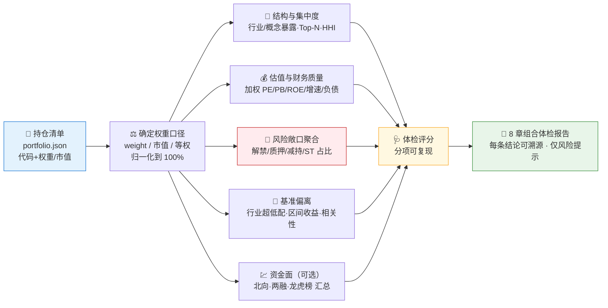
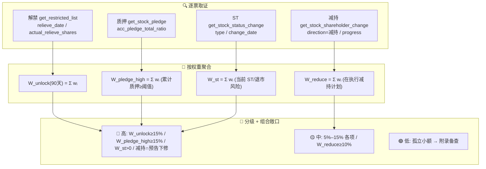

# 🩺 Portfolio Checkup Skill（持仓组合体检）

**简体中文** | [English](README.en.md)

> 输入一份持仓清单（代码 + 权重/市值），输出**组合层级**的体检报告：结构与集中度、估值与财务质量分布、风险敞口聚合（解禁/质押/减持/ST）、相对基准的行业偏离与资金面。不是看一只股票，而是看你**整个组合**有多集中、有多少比例暴露在风险下、和基准差在哪。

<p align="center">
  
  
  
  
  
  
  
</p>

---

## 📖 这是什么

`portfolio-checkup` 是一个 **Agent Skill**：把你的持仓清单（建议用本地 `portfolio.json` 维护）做一次**组合层级**的体检。它把分散在 Pandadata 的 15+ 个接口按 **5 个体检模块**串成流水线，先取每只成分股的事实，再用统一的**权重口径**聚合成组合指标，最终产出 8 章结构化报告 —— 每个结论都标注来源接口、报告期/数据日和查询窗口。

它最独特的能力是**把单票风险聚合成组合敞口百分比**：不是逐票告警"哪只要解禁了"，而是回答"我的组合有 **多少比例** 暴露在未来 90 天解禁/高质押/减持计划/ST 之下"。

> 本技能是 Pandadata 技能家族里的**组合编排层**。数据契约一律来自姊妹技能 [`pandadata-api`](https://github.com/quantskills/skill-pandadata-api)；本技能负责"查什么、怎么聚合、怎么判"，不负责"接口长什么样"。

---

## 🧭 它在技能家族中的位置（反撞车定位）

本技能把三个单点技能的逻辑**抬到组合层**，并与它们明确分工：

| 姊妹技能 | 它的视角 | 本技能的差异 |
|---|---|---|
| 🔬 [`a-share-stock-dossier`](https://github.com/quantskills/skill-a-share-stock-dossier) | 单票 · 深挖 | **组合加权聚合**视角；某只成分股要深挖时，把它**移交 dossier**，本技能停在加权聚合高度。 |
| 🚨 [`event-risk-alert`](https://github.com/quantskills/skill-event-risk-alert) | 逐票 · 定时告警 | **组合敞口汇总**；回答"组合有多少比例暴露在解禁/质押/减持/ST"，而非"今天哪只触发哪条告警"。 |
| 📊 [`index-valuation-rotation`](https://github.com/quantskills/skill-index-valuation-rotation) | 指数 / 行业层 | **针对你自己的持仓**，并做相对基准的**行业偏离**与区间收益/相关性，而非孤立分析指数本身。 |

---

## ⚡ 组合体检流水线



---

## 🗺️ 五大体检模块 × 接口映射

| 模块 | 接口 | 在组合层产出什么 |
|---|---|---|
| 🧩 **结构与集中度** | `get_stock_industry` · `get_industry_constituents` · `get_concept_constituents` | 加权行业分布、概念暴露、前 N 大权重、HHI 赫芬达尔集中度。 |
| 💰 **估值与财务质量** | `get_index_indicator` · `get_fina_reports` · `get_fina_forecast` · `get_share_float` | 组合加权 PE/PB/ROE/增速/负债率分布（对比基准指数估值）、业绩预告变脸的权重占比。 |
| 🚨 **风险敞口聚合** | `get_restricted_list` · `get_stock_pledge` · `get_stock_pledge_stat` · `get_stock_shareholder_change` · `get_stock_status_change` | 组合中**按权重计**暴露在未来解禁/高质押/减持计划/ST 下的比例（敞口百分比，而非逐票告警）。 |
| 🎯 **基准偏离** | `get_index_weights` · `get_index_indicator` · `get_stock_daily` | 相对基准指数（默认沪深300）的**行业超/低配偏离**、Active Share、区间收益与相关性。 |
| 💹 **资金面（可选）** | `get_hsgt_hold` · `get_margin` · `get_lhb_list` | 组合成分近期北向/两融/龙虎榜动向汇总。 |

> ⚠️ 接口口径要点：`get_stock_pledge` 是**逐票**质押（用 `acc_pledge_total_ratio` 累计质押占总股本比例判定高质押成分股、再求权重合计）；`get_stock_pledge_stat` 是**交易所/登记结算层**的市场统计（无 symbol 入参），只作市场背景，不当逐票值。`get_stock_detail` 不返回市值/总股本，市值口径回退须由 `get_share_float` 的股本 × `get_stock_daily` 收盘价估算并标注为估计值。

---

## 🚨 风险敞口聚合（本技能的核心）

把每只成分股的事件信号，**按权重汇总成组合敞口百分比**：



阈值可由用户覆盖；缺分母时自动降级为定性提示，并报告**已覆盖权重**，绝不把部分覆盖当成 100%。组合叠加敞口会被显式命名，例如 `解禁聚集 + 高质押重叠`、`减持计划 + 业绩预告下修`。完整口径、HHI/加权/偏离公式与评分规则见 [`references/checkup-guide.md`](references/checkup-guide.md)。

---

## 🚀 快速开始

### 1️⃣ 安装（与 pandadata-api 一起）

```bash
# Claude Code（全局）
cp -r skill-pandadata-api     ~/.claude/skills/pandadata-api
cp -r skill-portfolio-checkup ~/.claude/skills/portfolio-checkup

# Codex（全局，推荐开放 Agent Skills 标准目录）
mkdir -p ~/.agents/skills
cp -r skill-pandadata-api     ~/.agents/skills/pandadata-api
cp -r skill-portfolio-checkup ~/.agents/skills/portfolio-checkup

# Cursor（项目级）
mkdir -p .cursor/skills
cp -r skill-pandadata-api     .cursor/skills/pandadata-api
cp -r skill-portfolio-checkup .cursor/skills/portfolio-checkup
```

### 2️⃣ 维护持仓清单（本地 `portfolio.json`）

```json
{
  "as_of": "2026-06-29",
  "benchmark": "000300.SH",
  "weight_basis": "weight",
  "cash_weight": 0.05,
  "holdings": [
    { "symbol": "600519.SH", "name": "贵州茅台", "weight": 0.18, "cost": 1680.0 },
    { "symbol": "300750.SZ", "name": "宁德时代", "weight": 0.14 },
    { "symbol": "000001.SZ", "name": "平安银行", "market_value": 52000 }
  ]
}
```

- `weight_basis`：`weight` | `market_value` | `equal`，缺省按字段推断，混合或缺失降级为等权并声明。
- `weight` 与 `market_value` 二选一即可；`market_value` 口径下 `权重 = 市值 / Σ市值`。
- `cash_weight` 可选，归一化前扣除并披露；`cost` 仅作上下文，不计盈亏。
- 仓库内附 [`portfolio.json`](portfolio.json) 示例可直接改用。

### 3️⃣ 直接用自然语言提问

```text
读我的 portfolio.json，做一次组合体检
我的持仓行业是不是太集中了？HHI 多少？前五大权重多少？
我的组合有多少比例暴露在未来解禁和高质押下？
这个组合相对沪深300，超配/低配了哪些行业？
```

### 4️⃣ 报告结构（固定 8 章）

```
摘要与体检评分 → 组合结构与集中度 → 行业/概念暴露与基准偏离
→ 估值与财务质量分布 → 组合风险敞口聚合 → 资金面 → 行动建议(仅风险提示) → 数据附录
```

风险敞口以**组合权重占比**呈现（如"解禁市值占组合 6.2%，覆盖权重 92%"），并列出贡献最大的前几只成分股。

---

## 📦 目录结构

```
portfolio-checkup/
├── SKILL.md                      # 技能入口：工作流、模块接口映射、反撞车定位、规则、portfolio.json 格式
├── portfolio.json                # 📋 持仓清单示例（代码/名称/权重或市值/可选成本）
├── references/
│   └── checkup-guide.md          # 📒 集中度/HHI、加权聚合、风险敞口阈值、基准偏离、体检评分、报告蓝图、QA清单
├── agents/
│   ├── cursor-rule.mdc           # Cursor 适配
│   ├── openai.yaml               # OpenAI/Codex 适配
│   └── portable-loader.md        # Claude Code/Hermes/OpenClaw 适配
└── LICENSE                       # GPL-3.0-only
```

---

## 📐 核心约束

| 约束 | 说明 |
|---|---|
| ⚖️ 权重口径先声明 | 一次性确定按 `weight` / 市值 / 等权，并贯穿所有加权指标；权重（含现金）须对齐 100% |
| 🧮 公式透明 | HHI、Top-N、加权 PE/PB/ROE、偏离、敞口%、评分均写出公式与字段名，可复现 |
| 📉 缺分母降级 | 部分成分股缺值时报告**已覆盖权重**并降级为定性提示，不把部分覆盖当满覆盖 |
| 🔗 先查契约 | 所有调用先经 `pandadata-api` 核对参数字段，不发明接口/参数/字段 |
| 🧭 各司其职 | 单票深挖移交 `dossier`；逐票定时告警移交 `event-risk-alert`；本技能只做组合加权聚合 |
| 🗣️ 仅风险提示 | 行动建议只提示需关注的敞口，不下买卖指令；措辞克制 |

---

## ⚠️ 免责声明

本报告基于公开数据与规则化分析生成，仅供研究参考，不构成任何投资建议。

## 📜 License

This project is licensed under the GNU General Public License v3.0. See [LICENSE](LICENSE).

## 🐼 PandaAI / QUANTSKILLS 社群

<div align="center">
  
  <br>
  <sub>扫码加入 PandaAI 社群，交流 QUANTSKILLS 技能、Agent 工作流与量化研究实践。</sub>
</div>
