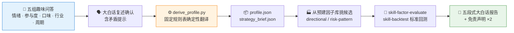

# 🧬 QBTI — Quant Behavior Type Indicator / 量化行为类型指标

**简体中文** | [English](README.en.md)

> 给你的投资性格做一次 QBTI：五组趣味问答了解你是哪种"投资人格"，按固定规则表翻译成因子方向与策略参数，再交给 QuantSkills 的因子库和回测流水线——全程大白话，专业但不劝退。（对，就是那种测完想转发的感觉，但底层是可审计的确定性规则表，不是玄学。）


---

## 📖 这是什么

`qbti`（**Q**uant **B**ehavior **T**ype **I**ndicator，曾用名"平凡人策略"）是一个面向**普通人**（非量化专业用户）的便携 Agent Skill。它不假设你懂 IC、夏普比率或者因子——它先用五个像性格测验一样的维度了解你（比喻由 agent 按你的兴趣现场定制：宠物、足球、游戏、做饭都行，下面只是示例）：

- 😱 **亏损反应**：账户一天跌 8%，你睡得着吗？→ 风险承受力、单票仓位上限
- 🐕 **参与度**：想养每天遛的柯基，还是每月浇水的多肉？→ 关注频率、调仓节奏
- 📺 **策略口味**：追热剧、挖冷门、还是重刷经典老剧？→ 因子家族偏好（动量/均值回归/低波动/反转）
- 🍚 **选股范围**：只点吃过的菜，还是菜单闭眼点？有忌口吗？→ 行业偏好与排除
- ⏳ **时间周期**：这笔钱的「重新考虑日」定在什么时候？→ 投资周期、换手容忍度

**包装自由，枚举固定**：问法千变万化，但每个回答最终都落到 `references/question_bank.md` 定义的封闭枚举上——这是问答层和映射层之间的硬契约。

然后用一张**固定的、可审计的映射表**（`references/preference_mapping.yaml`）把你的回答确定性地翻译成参数——不是 AI 现场发挥，同样的回答永远得到同样的翻译。翻译结果交给 QuantSkills 组织现有的因子库挑候选因子、交给 `skill-backtest` 按标准协议跑历史回测，最后用「这张图回答什么问题 / 怎么看 / 我们看到了什么 / 这意味着什么 / 数据来源」五段式大白话给你讲明白。

**本 skill 只做翻译，不做推荐。** 它把「你是什么样的人」翻译成「参数应该长什么样」，不替你做任何投资决定。

## 🧭 和姊妹技能的分工

| 技能 | 面向的人 | 做的事 |
| --- | --- | --- |
| **本 skill** | 「我不知道自己要什么」的小白 | 用问答**引导出**偏好，翻译成参数 |
| [`skill-ssquant-trader-generator`](https://github.com/quantskills/skill-ssquant-trader-generator) | 「我已经有一个策略想法」的人 | 把你**说出来的想法**解析成期货 AI 交易员 |
| [`skill-stock-screener`](https://github.com/quantskills/skill-stock-screener) | 「我有明确选股条件」的人 | 把**选股条件**翻译成数据查询 |
| [`skill-portfolio-checkup`](https://github.com/quantskills/skill-portfolio-checkup) | 「我已经有持仓」的人 | 给**现有组合**做体检 |

一句话：它们服务「有想法的人」，本 skill 服务「还没想法的人」。

## ⚡ 工作流



## 🚀 快速开始

### 1️⃣ 安装

```bash
# Claude Code（全局）
cp -r skill-qbti ~/.claude/skills/qbti
```

Codex 等平台：保持 `SKILL.md` + `references/` + `scripts/` 结构导入；`agents/openai.yaml` 提供适配。

### 2️⃣ 触发示例

```text
我完全不懂量化，但想给自己搞一个适合我性格的策略
帮我做一个平凡人也能懂的选股策略
我是小白，带我入门量化
```

### 3️⃣ 直接跑翻译脚本

推荐用 [uv](https://docs.astral.sh/uv/)（没有 uv 时用 `python` 也行——脚本纯标准库，无第三方依赖、无网络调用）：

```bash
uv run scripts/derive_profile.py \
  --answers examples/sample_run/sample_answers.json \
  --out examples/sample_run/
```

输出 `profile.json`（偏好画像）与 `strategy_brief.json`（流水线交接参数），示例见 [`examples/sample_run/`](examples/sample_run/)。

## 📦 目录结构

```text
skill-qbti/
├── SKILL.md                              # 技能入口：10 步工作流 + 措辞规则 + 输出契约
├── references/
│   ├── question_bank.md                  # 🎯 五组问答簇完整文案与枚举
│   ├── preference_mapping.yaml           # ⚙️ 枚举→参数固定映射表（核心可审计产物）
│   ├── profile_schema.md                 # 📋 profile.json / strategy_brief.json 字段契约
│   └── disclaimer_template.md            # ⚠️ 中英文免责声明标准文本
├── scripts/
│   └── derive_profile.py                 # 🐍 纯标准库确定性翻译 CLI（离线、无 LLM）
├── examples/
│   └── sample_run/                       # ✅ 示例输入输出
└── agents/
    └── openai.yaml                       # OpenAI/Codex 适配
```

## 📐 核心约束

| 约束 | 说明 |
| --- | --- |
| 🔒 只翻译不推荐 | 说「把你的回答翻译成参数」，不说「为你推荐策略」；输出永远不含买卖指令 |
| 📋 规则表驱动 | 偏好→参数的映射全部来自固定表，同样的回答永远得到同样的结果，可审计、可复现 |
| 🛡️ 只向保守让步 | 任何调节只允许把参数往更保守的方向调，绝不把自称焦虑的用户导向激进配置 |
| 🔍 默认值必须披露 | 用户拒答用默认值可以，但必须记入 `defaults_used` 并在确认环节念出来 |
| 📉 回测≠预测 | 所有数字来自 `skill-backtest` 标准协议下的历史模拟，展示时必须带假设 |
| 🎓 仅研究教育用途 | 不承诺收益、不暗示安全、不构成投资建议 |

## 🔗 推荐进阶技能（不自动调用）

- [`skill-factor-blend`](https://github.com/quantskills/skill-factor-blend) —— 有 2 个以上评价过的因子想合成时
- [`skill-portfolio-optimize`](https://github.com/quantskills/skill-portfolio-optimize) —— 想做更精细的仓位分散时
- [`skill-backtest-overfit`](https://github.com/quantskills/skill-backtest-overfit) —— **强烈建议**：把结果当真之前先做一次过拟合统计体检
- [`skill-event-risk-alert`](https://github.com/quantskills/skill-event-risk-alert) / [`agent-market-regime-monitor`](https://github.com/quantskills/agent-market-regime-monitor) —— 想要持续盯盘提醒时

## ⚠️ 免责声明

> **重要声明**
>
> 本技能（`skill-qbti`）通过趣味问答收集你对投资的偏好与心理倾向，并使用**固定规则表**将这些偏好翻译为可执行的选股因子方向、仓位与调仓参数——这是一种参数翻译工具，**不是投资建议、不是投顾服务、不构成任何形式的个性化投资推荐**。
>
> 本技能与其生成的所有内容均基于公开数据与规则化分析，仅供研究与教育参考，**不构成任何投资建议**，也不应被视为买卖任何证券的依据。文中如出现历史回测数据或指标，均来自 `skill-backtest` 等技能在特定假设（如 T+1 成交、固定交易成本、涨跌停与停牌处理规则等）下的历史模拟结果，**不代表未来表现，也不构成任何收益承诺或保证**。
>
> 本技能由社区开发者贡献，**非官方发布，不隶属于任何证券公司、基金公司或监管机构**，与 quantskills 组织及 Pandadata 数据源的官方立场无关。
>
> 投资有风险，入市需谨慎。请在充分了解自身风险承受能力，并咨询具备资质的专业投资顾问后，再做出任何投资决策。本技能的作者与贡献者不对因使用本技能所产生的任何直接或间接损失承担责任。

## 📜 License

This project is licensed under the GNU General Public License v3.0. See [LICENSE](LICENSE).

## 🐼 PandaAI / QUANTSKILLS 社群

<div align="center">
  
  <br>
  <sub>扫码加入 PandaAI 社群，交流 QUANTSKILLS 技能、Agent 工作流与量化研究实践。</sub>
</div>
