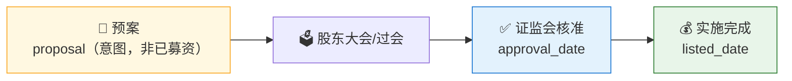

# 💧 Refinancing Monitor Skill

**简体中文** | [English](README.en.md)

> 社区状态：Draft（社区草案） · 创建者/维护者：[`abgyjaguo`](https://github.com/abgyjaguo)

> A股**再融资监控**：以**定向增发**（`get_stock_private_placement`）与**配股**（`get_stock_allotment`）为中心，按进程（预案→过会→核准→实施完成）追踪事件、以**占总股本比例**衡量稀释强度、发行/配股价对比现价（**折价与破发**）、按行业聚合 —— 全市场扫描或单票时间线，每个数据点标注来源接口与公告/进程日期。

<p align="center">
  
  
  
  
  
  
</p>

---

## 📖 这是什么

`refinancing-monitor` 是一个 **Agent Skill**：以**再融资事件**为中心扫描 A 股定增与配股，回答"**最近谁在募资、走到哪一步、稀释多少、发行价贵不贵、破没破发**"。它是 [`buyback-monitor`](https://github.com/quantskills/skill-buyback-monitor)（资本回报）的**镜像**——再融资是**募集资本、稀释老股东**，方向相反、形态相同。

两个接口都**一次事件按进程返回多行**（预案→过会→核准→实施完成），本技能先**去重到事件**，再追踪其最新进程；把**定增**（向特定对象）与**配股**（向全体股东按比例）明确分列；以新增股数占总股本比例衡量稀释；把发行/配股价对比现价看折价与破发。

> 数据契约一律来自姊妹技能 [`pandadata-api`](https://github.com/quantskills/skill-pandadata-api)；本技能负责"查什么、怎么去重、怎么算稀释与折价"，不负责"接口长什么样"。

---

## 🧭 与同生态技能的边界（避免撞车）

| 技能 | 视角 | 何时用 |
|---|---|---|
| 💧 **refinancing-monitor**（本技能） | **再融资事件**（定增/配股）全市场扫描 / 单票时间线 | "扫一遍最近的定增""配股有哪些""稀释强度榜""某票定增破没破发" |
| 🔁 `buyback-monitor` | **回购事件**（资本回报，与本技能相反方向） | 想看谁在回购、注销式回购 → 移交它 |
| 🚨 `event-risk-alert` | **自选/持仓**风险事件（解禁/质押/减持） | 想监控自己持仓的**风险**（定增落地后会产生未来解禁）→ 移交它 |
| 🩺 `a-share-stock-dossier` | **单票**深度尽调（资本运作只是其中一小节） | 想看某公司完整体检 → 移交它 |

---

## 🧬 再融资事件模型（分析前必读）



- **进程 `issue_status`**：报告每个事件**最新**进程；预案 ≠ 已募资，绝不混同。
- **定增 vs 配股**：两个接口天然分开，务必分列（稀释方式不同）。
- **稀释比例**：`issued_shares`/`actual_shares` ÷ 总股本（`get_share_float`），标注预案/已执行。
- **折价与破发**：`issue_price`/`allotment_price` 对比 `get_stock_daily` 现价；已执行且现价 < 发行价 = **破发**。
- **认购缺口**：配股 `actual_ratio` < `planned_ratio` = 认购不足。

---

## 🗂️ 报告章节 × 接口映射

| 章节 | 接口 | 回答什么 |
|---|---|---|
| 📋 **再融资事件总览** | `get_stock_private_placement`·`get_stock_allotment` | 窗口内新增事件、定增 vs 配股、去重后事件数 |
| 🫧 **进程漏斗** | `get_stock_private_placement`（`issue_status`） | 预案/过会/核准/实施完成 各多少（标注预案≠已募资） |
| 💲 **折价与破发** | 发行/配股价 + `get_stock_daily` | 发行价相对现价折价、已破发个股 |
| 💪 **稀释强度榜** | `issued_shares`/`actual_shares` + `get_share_float` | 占总股本比例 Top |
| 🧮 **认购缺口** | `get_stock_allotment`（`planned` vs `actual`） | 哪些配股认购不足 |
| 🏭 **行业分布** | `get_stock_industry` + 上述 | 哪些行业在集中再融资 |
| 🔓 **解禁衔接（可选）** | `get_restricted_list` | 定增落地股份何时上市流通 |

---

## 🚀 快速开始

### 1️⃣ 安装（与 pandadata-api 一起）

```bash
# Claude Code（全局）
cp -r skill-pandadata-api       ~/.claude/skills/pandadata-api
cp -r skill-refinancing-monitor ~/.claude/skills/refinancing-monitor

# Codex（全局，Agent Skills 标准目录）
mkdir -p ~/.agents/skills
cp -r skill-pandadata-api       ~/.agents/skills/pandadata-api
cp -r skill-refinancing-monitor ~/.agents/skills/refinancing-monitor

# Cursor（项目级）
mkdir -p .cursor/skills
cp -r skill-pandadata-api       .cursor/skills/pandadata-api
cp -r skill-refinancing-monitor .cursor/skills/refinancing-monitor
```

### 2️⃣ 直接用自然语言提问

```text
扫一遍最近半年全市场的定增，给我进程漏斗和稀释强度榜
最近有哪些配股？认购比例达标了吗
000001.SZ 的再融资进度到哪一步了？发行价相对现价折价多少、破没破发
帮我把定增和配股分开列一份再融资监控
设置一个每周盘后自动跑的再融资监控任务
```

### 3️⃣ 报告结构（9 章）

```
摘要 → 再融资事件总览 → 进程漏斗 → 折价与破发 → 稀释强度榜
→ 认购缺口 → 行业分布 → 风险提示 → 数据说明
```

数据说明为表格：`数据模块 | 来源接口 | 查询窗口 | 返回行数(去重前/后) | 快照日/公告区间 | 备注`。

---

## ⏰ 定时（可选）

在交易日盘后（建议 `18:00 Asia/Shanghai` 之后）运行，捕捉当日再融资公告；因再融资推进较慢，周度节奏也合理。任务幂等：`reports/refinancing/<scope>-<date>.md` 已存在则覆盖重写；非交易日跳过。

---

## 📦 目录结构

```
refinancing-monitor/
├── SKILL.md                          # 技能入口：定位边界、事件模型、工作流、接口映射、分析模式、规则、自动化
├── references/
│   └── refinancing-playbook.md       # 📒 路由表、进程/类型/稀释口径、去重规则、报告骨架、空数据处理、QA清单
├── scripts/
│   └── validate_report.py            # ✅ 校验报告章节/来源标注/进程口径/定增配股拆分/窗口/免责声明
└── agents/
    ├── cursor-rule.mdc               # Cursor 适配
    ├── openai.yaml                   # OpenAI/Codex 适配
    └── portable-loader.md            # Claude Code/Hermes/OpenClaw 适配
```

---

## 📐 核心约束

| 约束 | 说明 |
|---|---|
| 🧾 先查契约 | 所有调用先经 `pandadata-api` 核对定增/配股接口参数字段 |
| 🔀 定增配股分列 | 两者稀释方式不同，必须分别列示，再给合并视角 |
| 🔁 先去重再计数 | 一事件跨进程多行，全市场统计前必须去重到事件，取最新进程 |
| 📝 预案≠已募资 | 募资金额必须区分预案与实施完成 |
| 💪 稀释看基数 | 稀释比例须对明确的总股本基数（`get_share_float`）计算，缺基数则注明不猜 |
| 💲 折价破发相对表述 | 折价/破发用 `get_stock_daily` 现价，作相对观察，不下结论 |
| 📸 快照属性 | 再融资事件持续推进，扫描是某时点快照，须标注快照日/公告区间 |
| 🕳️ 空数据如实报 | 无新增再融资保留标题写明"无数据 + 方法/窗口" |
| 🗣️ 措辞克制 | 用"稀释比例较高""发行价折价 X%""已破发""认购不足"，不下涨跌结论 |

---

## ⚠️ 免责声明

本报告基于公开数据与规则化分析生成，仅供研究参考，不构成任何投资建议。

## 📜 License

This project is licensed under the GNU General Public License v3.0. See [LICENSE](LICENSE).

## 🐼 PandaAI / QUANTSKILLS 社群

<div align="center">
  
  <br>
  <sub>扫码加入 PandaAI 社群，交流 QUANTSKILLS 技能、Agent 工作流与量化研究实践。</sub>
</div>
