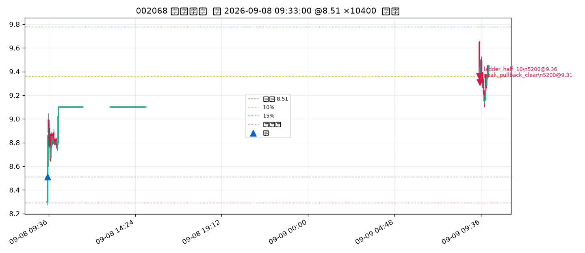
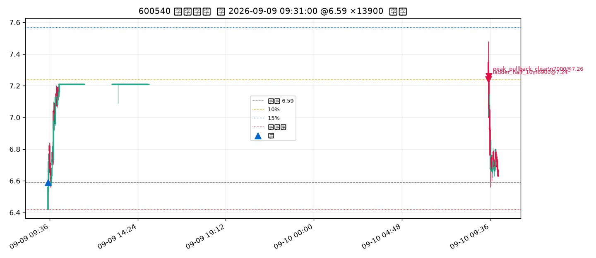
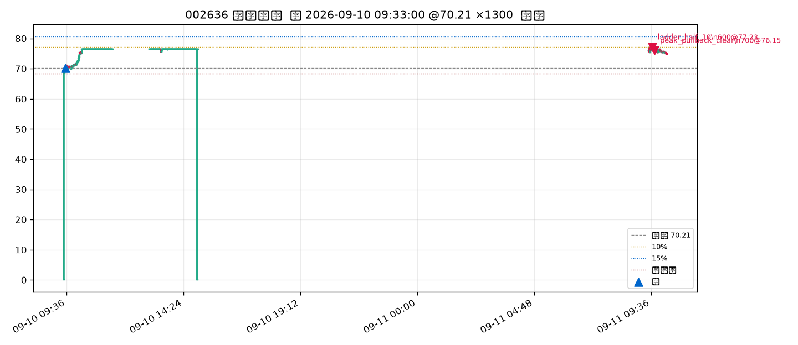
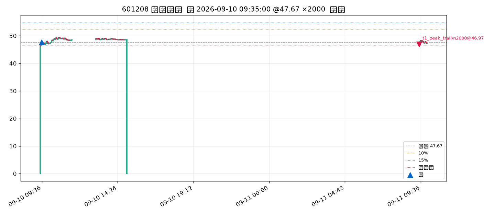
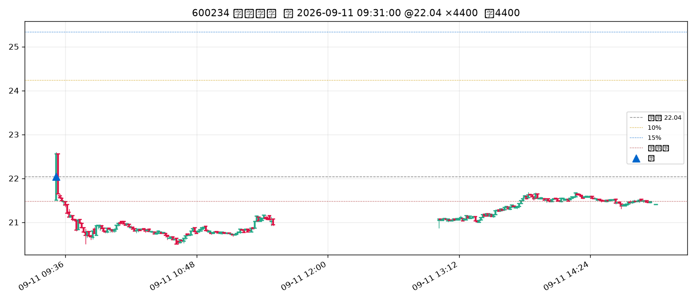

# 交割单 × 1 分钟 K 核对 · 2026-09-07～09-11

> 研究用途，非投资建议。短窗 5 日，不能当策略期望。  
> 2026-09-13 再跑 `PYTHONPATH=. python backtest/strategy1_pool_1m/run.py --pool strategy16 --days 5 --source ak --tag _audit0913`，成交与权益与 `_week202609` **逐笔相同**（12.2%，买 15 / 卖 15，期末三槽）。

## 结论

**个股 10% 半仓 / 未到 15% 则最高点回落把剩余全平，本周三笔都走对了。** 没有「半仓后又因还在 10% 上清掉」、也没有漏掉回落清剩余。本周没有任何一笔摸到 15%。

其余卖出（T1 峰值回落、硬保护、中赚波动回落）与 1m 路径一致。发现的问题是**数据脏 K** 和 **T+1 隔夜已破硬保护但当日不能卖**，不是半仓规则算错。

## 10% → 剩余全平（三笔）

成本 ×1.10 为半仓线；半仓后峰值 ×0.98 为剩余全平线；15% 本周都没摸到。

### 黑猫 002068 · 买 8.51（09-08 09:33）

| 分钟 | 高 / 低 | 判定 |
|------|---------|------|
| 09-09 09:31 | 9.66 / 9.30 | 高 ≥ 9.361（10%）→ **半仓 5200 @ 9.36**；同根低已破回落线，但同分钟优先半仓 |
| 09-09 09:32 | 9.50 / 9.31 | 峰值 9.66 ×0.98=9.47，低 9.31 打穿 → **剩余 5200 @ 9.31 全平** |

15% 线 9.79，全程没到。

### 新赛 600540 · 买 6.59（09-09 09:31）

| 分钟 | 高 / 低 | 判定 |
|------|---------|------|
| 09-10 09:31 | 7.48 / 7.22 | 高 ≥ 7.249 → **半仓 6900 @ 7.24**（13900 的一半按 100 股取整） |
| 09-10 09:32 | 7.30 / 7.00 | 峰值 7.48 ×0.98=7.33；开盘 7.26 已在线下 → **剩余 7000 @ 7.26 全平** |

15% 线 7.58，最高 7.48，没到。

### 金安 002636 · 买 70.21（09-10 09:33）

| 分钟 | 高 / 低 | 判定 |
|------|---------|------|
| 09-11 09:39 | 77.34 / 76.00 | 高 ≥ 77.23 → **半仓 600 @ 77.23** |
| 09-11 09:40–41 | 最高抬到 77.71 | 回落线随峰值上移到 76.16 |
| 09-11 09:45 | 77.10 / 76.00 | 低破 76.16 → **剩余 700 @ 76.15 全平** |

15% 线 80.74，没到。半仓后没有因为还在 10% 上方再砍一刀。

## 其它交割（对照 1m，无半仓问题）

| 票 | 路径 | 1m 核对 |
|----|------|---------|
| 郑州煤电 | 09-08 09:31 `t1_peak_trail` −1.42% | 买入日收盘未到 3%，次日开盘打穿隔夜高点回落 2.5% |
| 科新发展（第一笔） | 09-08 09:31 `hard_from_cost` −5.93% | 低开已破成本硬保护 2.5%，按开盘卖 |
| 天通 / 远东 / 海星 / 招商 | `vol_giveback` +3.3%～+5.9% | 中赚 3–10%，波动回落线比「回落一半」更高、先碰到，走波动全清（不是半仓） |
| 深科技 09-08 买 | 09-09 11:22 `t1_peak_trail` −2.51% | T1 已记，11:22 才打穿回落线 |
| 东材 | 09-11 09:30 `t1_peak_trail` −1.47% | 买入日收盘 +1.93% 未到 3% 已记；隔夜高 49.45 回落 2.5%=48.21，今开 46.97 已破，**开盘全清** |
| 深科技 09-10 买 | 09-11 09:31 `hard_from_cost` −3.14% | 次日低开破硬保护 |

## 期末三槽（周一才能动）

| 代码 | 成本 | 09-11 收 | 浮盈 | 说明 |
|------|------|----------|------|------|
| 000070 特发信息 | 16.29 | 17.16 | +5.34% | 买入日已过 3%，不记 T1；次日走中赚赛跑 |
| 600234 科新发展 | 22.04 | 21.40 | **−2.90%** | 硬保护在 21.49，收盘已破，但 **T+1 当日不能卖**；周一开盘应走硬保护 |
| 600869 远东股份 | 23.78 | 25.35 | +6.60% | 同特发，次日中赚 |

科新这笔跨周末浮亏，是规则允许的隔夜敞口，不是漏单。

## 仍有的问题

1. **1m 脏 K**：东财缓存里 09:30 / 14:58 / 14:59 常见 `open=0`（约 84 根）。本周成交没踩在这些残片上，但 `bar_open=0` 会让缺口判定少一次「开盘已破」。已在 `pool_1m._prep_minutes` 用收盘补开盘。
2. **09:30 一字 K**（开=高=低=收）是集合竞价快照。东材 T1 按这根开盘价卖，对齐「低开已破回落线按开盘走」，不是假触。
3. **短窗 + 阈值择优含本周**：12.2% 只能当执行核对，不能当样本外期望。
4. **无券商**：触发价必成；实盘滑点/排队会差一截。

## 1 分钟 K（买卖标注）

半仓三笔：







T1 开盘清、以及周末隔夜破硬保护：





复现：

```bash
PYTHONPATH=. python backtest/strategy1_pool_1m/run.py --pool strategy16 --days 5 --source ak --tag _week202609
PYTHONPATH=. python backtest/strategy16_core_leader/audit_week_1m.py --tag _week202609
```

研究用途，非投资建议。
